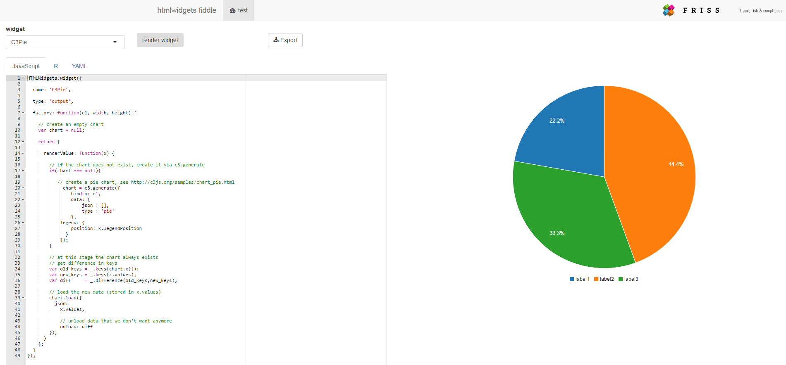

## Introduction

In the [previous](http://shiny.rstudio.com/tutorial/js-lesson1/) tutorial, we created a simple [C3](http://c3js.org/) based gauge widget. In this tutorial, we see how we can expand the widget to facilitate smooth transitions as can be seen in the [showcase Dashboard app](https://js-tutorial.shinyapps.io/dashboardApp/). Next to an improved gauge, we also provide code and examples for the other charts types shown in the dashboard i.e. a pie chart, a line + bar chart and a stacked area chart. In this tutorial we focus on creating the charts and to provide data in such a way that C3 can animate the transition between old and new data.


<iframe width='100%' height='300' src='http://jsfiddle.net/FrissAnalytics/tx38gstp/9/embedded/result' allowfullscreen='allowfullscreen' frameborder='0'></iframe>

<div style = "text-align:center; margin-bottom:25px" >example of a gauge with animated transitions between old and new data</div>  

Before we do all that let's first take a better look at the HTMLWidgets.widget function we saw in the first tutorial, which is related to the concept of factory methods and closures.

### Factory methods and closures

In the previous tutorial we saw that initially the skeleton of our widget looks like this

```javascript
HTMLWidgets.widget({

  name: 'C3Gauge',

  type: 'output',

  factory: function(el, width, height) {

    // TODO: define shared variables for this instance

    return {

      renderValue: function(x) {

        // TODO: code to render the widget, e.g.
        el.innerText = x.message;

      },

      resize: function(width, height) {

        // TODO: code to re-render the widget with a new size

      }

    };
  }
});
```
Even though this code block is not very long, compared to standard R code this code may look a bit strange for people new to JavaScript. We see that `factory` is a [method](http://www.w3schools.com/js/js_object_methods.asp), but the return type is not a simple value. What's with that?

In software engineering, the construction above is known as a design pattern called a [factory](http://www.oodesign.com/factory-method-pattern.html) method. This design pattern means we have a method that returns an object instance. That sounds complicated! Let's dig a little deeper to see what this means.

In more general terms a factory method like this:

```javascript
factory: function () {return {
  a: function() { ... },
  b: function() { ... }
}};
```

is equivalent to

```javascript
// factory is a method of some object
factory: function () {

  // define a new object
  var obj = new Object();
  
  // create a method a for it
  obj.a = function() { ... };
  
  // create a method b for it
  obj.b = function() { ... };
  
  // return the object instance
  return obj;
}
```

Hence, in our case the method `factory` in HTMLWidgets.widget returns a widget instance `object`, which itself has two methods i.e. `renderValue`, which is responsible for drawing our widget and `resize` which handles any resizing events of the component (if needed).
  
The implementation above is known as a <a href='http://www.w3schools.com/js/js_function_closures.asp'>closure</a>, which means the function remembers the scope it was created in and has access to the variables defined in that scope. A more in depth discussion on JavaScript closures is offered [here](https://developer.mozilla.org/en/docs/Web/JavaScript/Closures). Of note, the concept of closures also exists in R, see [here](http://adv-r.had.co.nz/Functional-programming.html#closures).


The implication of `renderValue` and `resize` being closures is that they have access to the `el`, `width` and `height` parameters passed to `factory`. Furthermore, we can initialize variables in the body of `factory` (above the definitions of `renderValue` and `resize`) that we want to use during the lifetime of our widget.


Now we have a better understanding of what our HTMLWidgets.widget function is doing, let's add some transitions to our gauge widget!

## Adding transitions to a C3 gauge

Even though the gauge widget from the first tutorial works, we can make it even better. The problem is that the widget always creates a completely new new gauge if we send it a value via shiny (using the `renderC3Gauge` function, see tutorial 1). It would be nicer if it would animate its state between the old value and the new value, as can be seen in the example on top. Luckily, C3 can create such transitions automatically. We do have to modify the code of our factory method though. 

In this context, its important to realize two basic states in the lifetime of a chart:

  1) the chart does not yet exist
  2) the chart already exists and we want to pass in new data, set options or send messages to it

In pseudo code our new factory method looks something like this


```javascript
factory: function(el, width, height){

  // we can define any variables we whish to use to keep track of the state of the widget here
  // lets create an empty chart
  var chart = null;

  return {
      renderValue: function(x) {
      
        // check if the chart exists
        if(chart === null){
        
           // the chart did not exist and we want to create a new chart
           chart = createChart(x);
           
           // store the chart on el so we can get it latter
           el.chart  = chart;
        }
           
        // at this stage the chart always exists 
        // get the chart stored in el and update it
        el.chart.updateChart(x);
        
      }
  }
}
```

The factory method has three arguments: `el`, `width` and `height`. Here `el` is the container element created by htmlwidgets where in which we will house our chart. On top we create a variable called `chart`, which initially we set to null, indicating that the chart is not yet initialized. 

Inside the `renderValue` method we first check if the chart is initialized. If the chart is not initialized, we create a chart via the toy function createChart, which in this case uses information in `x`. Subsequently, we store the chart on `el`, so we can access it later. 

Technically, the closure allows us to render the chart even in the first line i.e. at the line `var chart = null;`. In C3, however, we often need information stored in `x` during initialization. Note that `x` contains the data and chart options passed via shiny from R to JavaScript (using jsonlite, see tutorial 1). As C3 often needs information in `x` during initialization, here we initialize the chart inside the `renderValue` method and subsequently check if the chart was already created. This is slightly less elegant, however, it is quite easy and the overhead is minimal.   

Note that in all subsequent calls to `renderValue` the chart will be defined. In this case we first retrieve the chart via `el`, which we can access as `renderValue` is a closure, and subsequently call an update method on the chart which again uses information stored in `x`.

Let's convert the previous pseudo code into actual code for our gauge!

The next JavaScript code block shows how we can load new data into a C3 based chart created via [c3.generate](http://c3js.org/gettingstarted.html#generate).

```javascript
var chart = c3.generate({
  // chart code here
  ...
});

// some data
var newData = 50;

// load data into the chart
chart.load({
  json: newData
});
```

If we combine this code snippet with the previous factory pseudo code we end up with the code we're looking for

``` javascript
HTMLWidgets.widget({

  name: 'C3Gauge',

  type: 'output',

  factory: function(el, width, height) {

    // create an empty chart
    var chart = null;
  
    return {

      renderValue: function(x) {
      
        // check if the chart exists
        if(chart === null){
        	
        	// the chart did not exist and we want to create a new chart via c3.generate
          chart = c3.generate({
        		bindto: el,
        		data: {
        			json: x,
        			type: 'gauge',
        		},
        		gauge: {
        			label:{
        				format: function(value, ratio){ return value;}
        			},
        			min: 0,
        			max: 100,
        			width: 15,
        			units: 'value'
        		}
        	});
        	
        	// store the chart on el so we can get it latter
          el.chart = chart;
        }
        
        // at this stage the chart always exists 
        // get the chart stored in el and update it
        el.chart.load({json: x});
          
      }
    };
  }
});

```
Of note, for brevity here we omitted the `resize` method (which is optional).

When we re-install and reload the package and run our app we can see the gauges updating smoothly as in this live toy app (click on the image below).


<p style = "margin:25px">
  <a href = "https://frissdemo.shinyapps.io/GaugeApp/" target = "_blank"></img></a>
  <div style = "text-align:center">toy app with animated gauges</div>  
</p>


The complete version of our C3 gauge widget can be found [here](https://github.com/FrissAnalytics/shinyJsTutorials/tree/master/widgets/C3) and it can directly be installed by running the following command in R

```R
 devtools::install_github("FrissAnalytics/shinyJsTutorials/widgets/C3")
```

### Htmlwidget fiddle app

Building, installing and loading a package each time you want to test something can become a bit cumbersome, especially if you just want to play around with an example and experiment to find our how something works. For the purpose of these tutorial series, we created a small helper online app in which you directly can see what the impact is when you change a line or code, similar to a JavaScript fiddle. You can find the online app [here](https://js-tutorial.shinyapps.io/WidgetFiddle/).

<p style = "margin:25px">
  <a href = "https://js-tutorial.shinyapps.io/WidgetFiddle/" target = "_blank"></img></a>
  <div style = "text-align:center">htmlwidget fiddle app. Play with C3 code & create a package right from the browser!</div>  
</p>

#### about the app
All widgets in this tutorial series are available in the app. You can select a widget in the drop-down list after which its R code, JavaScript code and YAML contents are loaded in the corresponding tabs. You can then play around with code changes and see the effect by pressing the 'render widget' button. 


You can also export the  code as a zipped R package, which can be installed by opening the .Rproj file in RStudio and running `devtools::install()`. Currently, the functionality of this app is still limited. We plan to update the functionality of this app during the course of the tutorial series i.e. by allowing you to upload your own data and to add additional JavaScript and CSS files. 


## C3 data update pattern

The gauge is by far the most simple visualization C3 offers. More complex charts require more complex data objects. In C3, each data series is associated with a unique `key`. These keys help us to keep track of which data series are in the chart, which data parts need an update and which data we want to remove. 


To be more specific, when C3 loads a new data set via the `load` method, it will overwrite data if the key you provide is already present. However, when the key is not already present, the data you provide for that key will be added to the data it already has! As a consequence, if you want to remove data, you'll have to explicitly remove it for a given key. To illustrate this process, consider the following example.

Assume we have the following data: `{key1 = 10, key2 = 25}`, and in a next step we want to use: `{key1 = 20, key3 = 30}`. Notice that in the new data key2 is *not* present. Without unloading, loading the new data set will result in the data `{key1 = 20, key2 = 25, key3 = 30}`. In this case C3 updates the data for key1, left the data for key2 unchanged, and added data for key3. In order to make the correct update, we have to remove the data for key2, which we can do via an `unload` statement (see below).


## C3 Pie chart widget

With the gauge chart fully handled, let's create a C3 based pie chart with animated transitions! Just like in our first tutorial, let's first take a look at the HTML and JavaScript code via a JSfiddle.

<iframe width='100%' height='450' style = 'padding-bottom:25px' src='http://jsfiddle.net/FrissAnalytics/umu7Lnrv/12/embedded/result,js,html' allowfullscreen='allowfullscreen' frameborder='0'></iframe>

The steps of creating other C3 widgets are very similar to the process described for the gauge widget. In the remainder we therefore focus on complete code segments for the R and JavaScript parts, in which various parts are explained via code comments inside the code blocks. 

In the charts below we use various C3 specific chart options. A complete overview of all these options (including additional classes & methods) can be found in the [C3 reference](http://c3js.org/reference.html). In addition, the complete R, YAML and JavaScript code for all the widgets constructed in this tutorial can be found here [add ref].


Similar to the first tutorial, we can create the template code for a C3 pie widget via the R command:

```R
htmlwidgets::scaffoldWidget("C3Pie", edit = FALSE)
```

This command creates a C3Pie.js and C3Pie.yaml file in the inst/htmlwidgets folder and a C3Pie.R file in the R folder of your package (see [tutorial 1](http://shiny.rstudio.com/tutorial/js-lesson1/)).

The R part of our code looks like this

```R
C3Pie <- function(values, legendPosition = "bottom", width = NULL, height = NULL) {

  # forward options using x
  x = list(
    values = values,
    legendPosition = legendPosition
  )

  # create widget
  htmlwidgets::createWidget(
    name = 'C3Pie',
    x,
    width = width,
    height = height,
    package = 'C3'
  )
}

```

Note that we added two arguments i.e. `values`, which contains the individual pie values and `legendPosition`, which takes as values 'bottom', 'right', and 'inset' (see [here](http://c3js.org/reference.html#legend-position)). As before, any data is passed by the variable `x`.


In JavaScript, we can subsequently access these variables via `x.value` and `x.legendPosition`, respectively. In the R code above, `values` is a list object. For instance, we can specify the pie data as `list('data1'=30,'data2'=120)`. 


As noted in the [tutorial 1](http://shiny.rstudio.com/tutorial/js-lesson1/#step-3), it is worthwhile to experiment with [jsonlite](https://cran.r-project.org/web/packages/jsonlite/vignettes/json-aaquickstart.html) to see how R structures are converted from R to JavaScript. 


For instance, in R run:

```{r}
jsonlite::toJSON(list('data1'=30,'data2'=120))
```

The output results in `{"data1":[30],"data2":[120]}`. Aside from the extra brackets the output looks like the structure we would like to have. The extra brackets imply an array with a single value which for this purpose is the same as a single number. 

The JavaScript code for our pie widget looks like this: 


```javascript
HTMLWidgets.widget({

  name: 'C3Pie',

  type: 'output',

  factory: function(el, width, height) {

    // create an empty chart
    var chart = null;

    return {

      renderValue: function(x) {

        // if the chart does not exist, create it via c3.generate
        if(chart === null){

           // create a pie chart, see http://c3js.org/samples/chart_pie.html
             chart = c3.generate({
                bindto: el,
                data: {
                    json : [],
                    type : 'pie'
                },
            legend: {
                position: x.legendPosition
              }
            });
        }

        // at this stage the chart always exists
        // get difference in keys
        var old_keys = _.keys(chart.x());
        var new_keys = _.keys(x.values);
        var diff     = _.difference(old_keys,new_keys);

        // load the new data (stored in x.values)
        chart.load({
          json:
            x.values,

            // unload data that we don't want anymore
            unload: diff
        });
      }
    };
  }
});
```

In the JavaScript code above we use the helper function `getDiffKeys` to determine the difference in keys between the old and new data. In R, computing set differences is easy e.g. via `setdiff`. Obviously, in JavaScript we cannot use this function. How can we compute this difference? 

Luckily, in JavaScript there are many tool-belt helper libraries that offer many handy functions to manipulate data. A popular library worth checking out is [underscore](http://underscorejs.org/), which we use to help us work with data keys. Using underscore, the complete code of our helper function looks like this:

```javascript
function getDiffKeys(chart,x){
  // old keys
  var curKeys = _.keys(chart.x());
  
  // new keys
  var newKeys = _.keys(x.values);
  
  // difference
  diff = _.difference(curKeys,newKeys);
  
  return(diff)
}
```

We put this function in a seperate file "C3common.js" because it will be shared with other widgets. In our yaml we will refer to this file.

This code snippet uses [_.keys](http://underscorejs.org/#keys) and [_.difference](http://underscorejs.org/#difference) from underscore. Don't worry if this snippet looks complicated, it's just a little helper routine that we use in various C3 widgets. Even though a complete understanding of this code is not necessary, we highly recommend you check out what underscore can do, as being able to work with JavaScript objects and arrays is really helpful in building widgets!


The YAML file for our pie widget looks like this:

```javascript
dependencies:
- name: d3
  version: 3.5.0
  src: htmlwidgets/lib/d3
  script: ./d3.min.js
- name: c3
  version: 0.4.10
  src: htmlwidgets/lib/c3
  script: ./c3.min.js
  style: ./c3.min.css
- name: underscore
  version: 1.8.3
  src: htmlwidgets/lib/underscore
  script: ./underscore-min.js
```


Note that we added a reference to underscore, which is needed by our helper function to compute differences in keys (see above).

Using the code in the repo [add link] we can test our C3 pie widget via

```R
devtools::install()
C3Pie(message=list(data1=200,data2=300,data3=100))
```


## C3 combination chart

Instead of creating a single chart like a line chart or a bar chart, C3 allows you to create [combination charts](http://c3js.org/samples/chart_combination.html), in which you can combine several chart types into a single chart. 

<iframe width='100%' height='300' style = "padding-bottom:25px" src='https://fiddle.jshell.net/FrissAnalytics/gzx4sxqn/embedded/result,js,html' allowfullscreen='allowfullscreen' frameborder='0'></iframe>


In this segment we combine a bar chart with a set of line charts. In addition, we'll add a subchart to it which we'll use in a later tutorial to create a time based filter.

<iframe width='100%' height='400' src='https://fiddle.jshell.net/FrissAnalytics/hu5j1yan/embedded/result,js,html' allowfullscreen='allowfullscreen' frameborder='0'></iframe>


Looking at the fiddle you can see we have a lot more options to deal with. To keep things simple, we're not going parametrize all of them. In the widget below, the user provides a single dataframe called `dataset`, with a time column (used for the x-axis) and a set of additional columns (used as y-values) for the bar and line series. Furthermore, the user must specify the a `colors` variable that holds the display colors for the bar and line charts. 


Here's the complete R code for our C3LineBarChart widget:

```R
C3LineBarChart <- function(dataset, colors, width = NULL, height = NULL) {

  # forward options using x
  x = list(
    dataset  = dataset,
    colors   = colors
  )

  # create widget
  htmlwidgets::createWidget(
    name = 'C3LineBarChart',
    x,
    width = width,
    height = height,
    package = 'C3'
  )
}
```

From the JSfiddle we can see C3 want the data in this format:

``` javascipt
var dataSet = [
		{"Time":"2016-01-01","GREEN":1,"RED":2,"Total":3},
		{"Time":"2016-01-02","GREEN":4,"RED":5,"Total":6},
		{"Time":"2016-01-03","GREEN":7,"RED":9,"Total":9}
];
```

From R, we can obtain this format by providing the data as a dataframe. Let's test this assertion with jsonlite:

``` {r}
    dataset <- data.frame(Time  = c("2016-01-01","2016-01-02","2016-01-03"),
                          GREEN = c(1,4,7),
                          RED   = c(2,5,9),
                          Total = c(3,6,9) )

    jsonlite::toJSON(dataset)
```

Nice, precisely what we need!

The complete JavaScript code for our C3LineBarChart looks like this:

```javascript
HTMLWidgets.widget({

  name: 'C3LineBarChart',

  type: 'output',

  factory: function(el, width, height) {

    // create an empty chart
    var chart = null;

    return {

      renderValue: function(x) {

        // if the chart does not exist, create it via c3.generate
        if(chart===null){

            keys = _.keys(x.dataset);

          	chart = c3.generate({

          	  // specify the container element we want the chart to render in
          		bindto: el,
          		data: {

          		  // intialize with an empty array
          			json: [],
          			keys: {
          			      // use Time for x-axis
          			      x: "Time",

          			  // use the remaining data for y-values
          				value: keys,
          			},

          			// set chart types
          			types: {

          		  	// default is line, we want totals to be displayed as bars
          				Total: 'bar'
          			},
          			axes: {
          			  // extra y-axis
          				Total: 'y2'
          			}
          		},
          		axis: {
          			x: {
          			  //  x axis as timeseries
          				type: "timeseries",

          				// tick format x-asis
          				tick: {
          					format: "%Y-%m-%d"
          				}
          			},
          			y2: {
          			  // we want a second y-axis
          				show: true
          			}
          		},

          		// display a subchart - this will be used for brushing in a later stage
          		subchart: {
          			show: true
          		}
          	});
        }

        // at this stage the chart always exists
        // get difference in keys
        var old_keys = _.keys(chart.x());
        var new_keys = _.keys(x.dataset);
        var diff     = _.difference(old_keys,new_keys);

        // update the data and colors
        chart.load({
          json  : x.dataset,
          colors: x.colors,

          // unload data that we don't need anymore
          unload: diff
        });
      }
    };
  }
});
```

As you can see this code is a bit more involved. However, mostly we are only specifying specific C3 options. An overview of the complete set of available options can be found in the [C3 reference](http://c3js.org/reference.html). 


The concept of rendering this chart is the same as for the pie chart. We make sure we hand the data to JavaScript in the correct format, we initialize a chart with an empty array, compute any differences in keys relevant to unloading specific series and subsequently load and unload data.  


In order to improve your knowledge and practical experience of creating and setting options for C3 charts you can use our [widget builder app app](https://js-tutorial.shinyapps.io/WidgetFiddle/) and see what specific code changes will do! In doing this it's probably best to keep a separate tab open with the [C3 reference](http://c3js.org/reference.html).

Of note, in a later part of the tutorial series we will use the subchart we created here for to pick up brush events and to send information back to shiny so we can create a brush-able time based filter. 


Finally, the YAML file for this widget is the same of for our pie chart. 

When we install our C3 package [add ref], we can create a C3LineBarChart via:

```R
dataset <- data.frame(Time=c("2016-01-05","2016-01-12","2016-01-24"),
                      GREEN=c(0.1,0,0.2),
                      RED=c(0.9,1,0.8),
                      Total=c(320,210,190))
colors      <- list(Total="gray",GREEN="Green",RED="Red")
C3LineBarChart(dataset = dataset,colors=colors)
```


## C3 Stacked area chart widget

Our last chart is very similar to the combination chart above. Here we create a C3 [stacked area chart](http://c3js.org/samples/chart_area_stacked.html). As all the concepts for this widget are repetitions from the previous charts we keep the description of this widget brief. Here's a fiddle showing how to code a C3 stacked area chart:


<iframe width='100%' height='420' style = "padding-bottom:25px" src='https://fiddle.jshell.net/FrissAnalytics/b71gsdy9/embedded/result,js,html' allowfullscreen='allowfullscreen' frameborder='0'></iframe>

The corresponding R code for our stacked area chart widget looks like this:


```R
HTMLWidgets.widget({

  name: 'C3StackedAreaChart',

  type: 'output',

  factory: function(el, width, height) {

    // create an empty chart
    var chart = null;

    return {

      renderValue: function(x) {

        // if the chart does not exist, create it via c3.generate
        if(chart===null){

          var keys = _.keys(x.dataset);

        	chart = c3.generate({
        		bindto: el,
        		data: {
        			json: [],
        			keys: {
        			    x: "Time",
        				  value: keys,
        			}
        		},
        		axis: {
        			x: {
        				type: "timeseries",
        				tick: {
        					format: "%Y-%m-%d"
        				}
        			}
        		}
        	});

      }

      // at this stage the chart always exists
      // get difference in keys
      var old_keys = _.keys(chart.x());
      var new_keys = _.keys(x.dataset);
      var diff     = _.difference(old_keys,new_keys);

      //chart.groups([x.groups]);

      // update the data
      chart.load({
        // new data
        json  : x.dataset,

        // new colors
        colors: x.colors,

        // remove data we no longer need (if any)
        unload: diff,

        // set types
        types : x.types
      });
    }
   };
}});
```

Finally, like before the YAML file is similar to the one for the line bar chart and pie chart.

In R, the stacked area chart widget can be rendered via the following snippet:

``` r
dataset <- data.frame(
  Time  = c("2016-01-05","2016-01-12","2016-01-24"),
  GREEN = c(0.5,0.2,0.3),
  RED   = c(0.5,0.8,0.7))

colors  <- list(GREEN = "green", RED = "red")

C3StackedAreaChart(dataset,colors)
```

Note that we create a named list to set the colors such that the data keys line up with the display colors we want to use. 

## Next tutorial

Hooray, at this stage we have created code for all four widgets in the [showcase dashboard app](https://js-tutorial.shinyapps.io/dashboardApp/)! In the next tutorial we see how we can send messages from R to our widgets and back. The messages allow us to manipulate charts from R and to create linked visualizations in which one widget reacts to another widget. 
