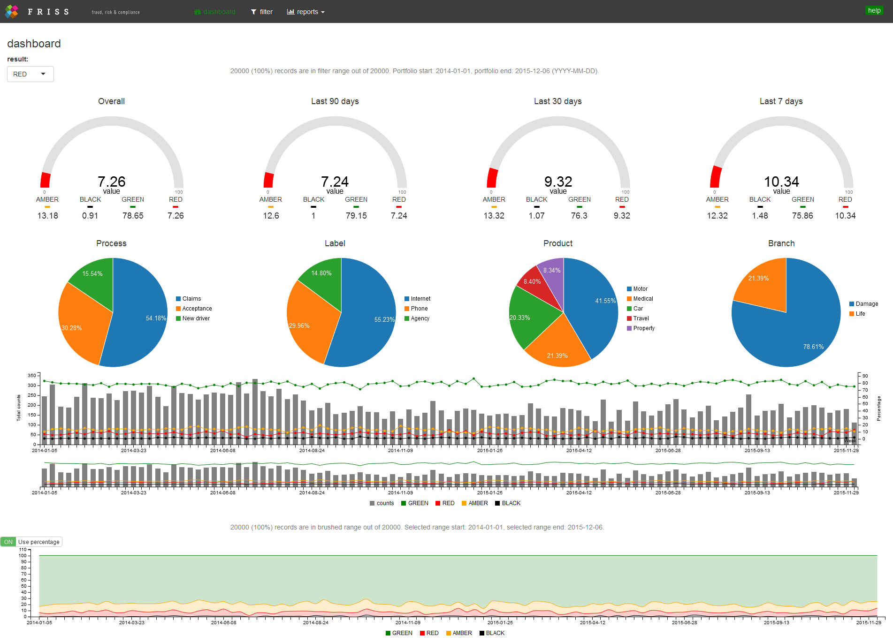
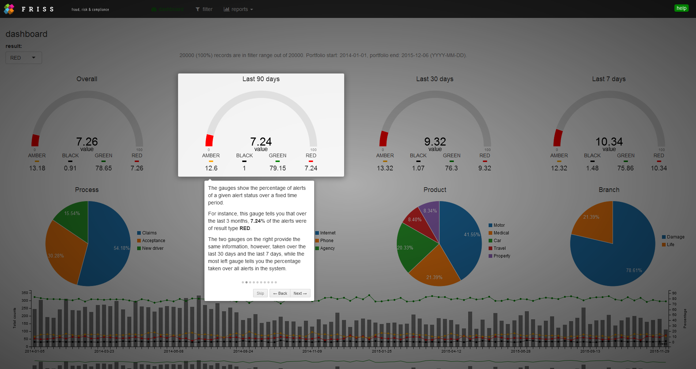

## Introduction

<a href="http://shiny.rstudio.com/" target="_blank">Shiny</a> is a web application framework that makes it easy to build interactive web applications (apps) straight from R. A key feature of shiny is that users can create powerful apps driven by R without having to know [HTML](http://www.w3schools.com/html/default.asp), [CSS](http://www.w3schools.com/css/default.asp), or [JavaScript](http://www.w3schools.com/js/default.asp). However, incorporating these technologies into your apps can greatly enhance the power of shiny.


Furthermore, in recent years there has been a shift from using base R graphics to using interactive JavaScript web components for data analysis and data visualization. In order to use the functionality offered in these frameworks, we have to construct R bindings to JavaScript libraries. 


The <a href="http://www.htmlwidgets.org/" target="\_blank">htmlwidgets</a> package provides a framework for creating such bindings and allows you to bring the best of JavaScript into R using a set of easy-to-follow conventions. After a widget has been constructed, embedding it into a shiny app or R Markdown document only takes a few lines of code. For some examples on what htmlwidgets can do, take a look at the  <a href="http://www.htmlwidgets.org/showcase_leaflet.html" target="_blank">showcase</a> on the htmlwidgets website.


Even though using an htmlwidget is easy, constructing one may be challenging at first as you have to know a number of concepts in order to create a widget. These include things such as how to build an R package and how to use some basic JavaScript, CSS and HTML. However, you don't need to be an expert in these things to create quite useful new functionality.  


The tutorials below are intended for the intermediate shiny enthusiast with limited experience in HTML, CSS and/or JavaScript, who wants to learn how to extend shiny. A useful first step in this process is to be able to create your own htmlwidgets.


### Creating a dashboard app

The widgets we are going to build are all based on <a href="http://c3js.org/" target="\_blank">c3.js</a>, which in turn is built on the more extensive JavaScript visualization library <a href="https://d3js.org/" target="\_blank">d3.js</a>. C3.js provides a variety of chart types, such as gauges, pie charts, stacked bar charts, stacked area charts and charts to display time series. Furthermore, c3.js provides a variety of <a href="http://c3js.org/examples.html" target="\_blank">APIs</a> and callbacks to access and update the state of a chart after it's rendered.


In order to master the technique of creating widgets, we will construct an interactive dashboard application which includes a variety of htmlwidgets based on c3.js. A screenshot of the end result can be seen below. A live version of a more complete version of our dashboard can be seen <a href="https://js-tutorial.shinyapps.io/dashboardApp/" target="_blank">here</a> (this app is best viewed on a high res screen). 

<p style = "margin:25px">
  <a href = "https://js-tutorial.shinyapps.io/dashboardApp/" target = "_blank"></img></a>
  <div style = "text-align:center">the end result of the tutorials</div>  
</p>


<p>
During the tutorials that follow, we will gradually build more complex widgets with more functionality. The end result will be a fully functional dashboard. An advantage of using JavaScript over base R graphics is that we have access to various types of <a href="http://www.w3schools.com/js/js_events.asp" target="\_blank">events</a> e.g. hover, click and drag events. For instance, the dashboard will have a nice brush-able timeline component. 
</p>

<p style = "margin:25PX">
  </img>
  <div style = "text-align:center">a brush-able timeline which acts as a data filter</div>  
</p>

<p>
The timeline acts as a time based filter for all of the data in the other charts. In the tutorials, we will take a deeper look into the notion of sending data from the client to the server and back using shiny. This functionality will be based mainly around three pivotal functions: the JavaScript functions `Shiny.onInputChange`, `Shiny.addCustomMessageHandler` and the R Shiny function `sendCustomMessage`. A great introduction to these functions is offered in 
<a href="https://ryouready.wordpress.com/2013/11/20/sending-data-from-client-to-server-and-back-using-shiny/" target="_blank">this</a>
blog post, and we will discuss each function in detail within the tutorials as well.
</p>

### Dashboard data 


The data in the dashboard represents data from an insurance company that screens persons who apply for a new insurance during underwriting. Underwriting is the process in which an insurance company assesses whether or not it should accept a person into their portfolio. If the risk for specific type of claims is deemed too high, the insurer may decide to reject an application. For the purposes of the tutorials, we use a toy dataset of 20,000 rows which looks like this:

```{r echo = FALSE, warning=FALSE, message=FALSE,prompt=FALSE, comment=""}
load("data.RData")
data
```


Each row represents a new screening. The column `id` provides a unique case, while the column `date` indicates the date at which a person was screened. The column `score` indicates the risk score estimated by the insurance company. Higher scores indicate that the person has a higher estimated probability to file a claim or to commit fraud somewhere in the future. The column `result` refers to a discretized version of the score column. For our dashboard this is the most important variable. Scores between 0 and 50 are mapped to GREEN, while scores from 51 to 75 are mapped to AMBER. Scores above 100 are mapped to RED, which indicates the highest risk group. The final four columns indicate the `branch`, `product`, `process`, and `label` associated with the policy application. The exact meaning of these categories depends on the insurer. Their main purpose is to help the insurer to process new policy applications more quickly.


In the screenshot above, the four [gauges](http://c3js.org/samples/chart_gauge.html) indicate the percentage of RED cases for a specific time period. You can select the percentages for different risk groups with the drop-down menu on the left. The four [pie](http://c3js.org/samples/chart_pie.html) charts indicate the distribution of the screenings over the various processes, labels, product and branches. The bar + line chart is an example of a c3.js [combination chart](http://c3js.org/samples/chart_combination.html) with dual y-axes and a single x-axis indicating time. The gray bars indicate the total number of screenings for each week (left y-axis), while the green, amber and red lines correspond to the percentage of cases which are estimated as GREEN, AMBER or RED, respectively (right y-axis). Finally, the bottom chart shows the same information, but this time as a [stacked area chart](http://c3js.org/samples/chart_area_stacked.html). The toggle button on the left allows you to toggle between displaying percentages or absolute counts. 


For each chart type, we'll create a separate [htmlwidget](http://www.htmlwidgets.org/). For the toggle button, we'll make a shiny [input binding](http://shiny.rstudio.com/articles/building-inputs.html) (see below). 

### Creating a dynamic help system

In addition to teaching you how to create widgets, the tutorials will teach you how to create an interactive, dynamic help system, complete with animated transitions. The help system is based on another JavaScript library, <a href="http://introjs.com/" target="\_blank">intro.js</a>. This library allows you to create a step-by-step guide for a website. It will draw a nice box around elements of your choice, combined with an annotation layer and a navigation system. Here's an example of how the help will look for one of the gauges in the dashboard. 

<p style = "margin:25PX">
  </img >
  <div style = "text-align:center">the help system</div>  
</p>


### Creating your own input binding

We end the tutorials with the creation of a custom [input binding](http://shiny.rstudio.com/articles/building-inputs.html). Input bindings are components that capture events from the client, i.e. the webpage, and send it to Shiny. A simple example of an input binding is an [action button](http://shiny.rstudio.com/reference/shiny/latest/actionButton.html). It captures a click event from the user and sends it to shiny. Here, we'll create a nice looking toggle switch based on the [bootstrap-switch](http://www.bootstrap-switch.org/examples.html) JavaScript library. We'll use the switch to toggle a c3.js stacked area chart to display either absolute counts or percentages. Here's an example of the switch we will be creating. Press the button and see what happens!

<script src="bootstrap-switch.min.js"></script> 

<p>
  <div style = "width: 150PX; margin: 25PX auto">
  <input type="checkbox" id="test" checked data-label-width="auto" class="Switcher" data-size="mini" data-on-color="success"   data-off-color="danger" data-label-text="Use percentage"/>
  <script>$("#test").bootstrapSwitch();</script>
  <script>$("#test").bootstrapSwitch("state",true);</script> 
  </div>
</p>

<p>
  <div style = "text-align:center">an example of a custom input binding in the form of a toggle switch</div>  
</p>


### Tutorial materials

All the content related to the examples below can be found on [this](https://github.com/FrissAnalytics/shinyJsTutorials) GITHUB repo. GITHUB is a code hosting platform for version control and collaboration. You can find more information on GITHUB [here](https://guides.github.com/activities/hello-world/). You can also download the tutorial materials as a single [ZIP](https://github.com/FrissAnalytics/shinyJsTutorials/archive/master.zip) file. Over the course of the next months various additional tutorials will be made available in this repo.  


## Stand alone examples

We will start with the most simple visualization c3.js offers: a gauge. Before involving R and shiny, we will make a simple stand alone JavaScript HTML version to show how the component and c3.js work in general.


Each stand alone example is presented in a <a href="https://jsfiddle.net//" target="_blank">jsfiddle</a>, which is a webpage where you can interactively run HTML, CSS and JavaScript code. By clicking "Edit in JSFiddle" in the panel below, you can alter the code and see what the effect of your change is. Working with fiddles is a great way to learn how a specific library or piece of code works. For example, by changing the value 75 on the first line of the JavaScript panel and clicking on the "Run" button in the left corner you will see the value of the gauge change.


<iframe width='100%' height='350' src='https://jsfiddle.net/FrissAnalytics/01tv8ojm/6/embedded/result,js,html' allowfullscreen='allowfullscreen' frameborder='0'></iframe>


## Recipe to construct charts

What steps are needed to create a chart in HTML / JavaScript compared to R? It turns out that the typical steps are to:

1. include library specific CSS and JavaScript files
2. create a container element in which we can house the chart
3. make sure we have data in the right format to feed to the chart
4. render the chart in the container using library specific instructions

and, optionally, to

5. send updates to the chart, e.g. update its data or update parameters that alter the appearance of the chart


## A first example

Let start with a first example, let's make a c3.js [gauge](http://c3js.org/samples/chart_gauge.html) chart! Here is the complete code for our first example:

```html
<html>
<head>
	<link href="c3.min.css" rel="stylesheet" type="text/css">
</head>
<body>

<div id="chart1"></div>

<script src="d3.v3.min.js" charset="utf-8"></script>
<script src="c3.min.js"></script>

<script>
var gaugeData = {data: 75};	
  
var chart1 = c3.generate({
  bindto: '#chart1',
  data: {
    json: gaugeData,
    type: 'gauge',
  },
  gauge: {
    min: 0,
    max: 100
  }
});
</script>

</body>
</html>
```

This code corresponds to [example_01_gauge.html](https://raw.githubusercontent.com/FrissAnalytics/shinyJsTutorials/master/examples/example_01_gauge.html) in the examples folder of [this](https://github.com/FrissAnalytics/shinyJsTutorials/tree/master/examples) repository.

 
Let's break down this code into the steps stated in the previous section.


### step 1

In our example, we include one CSS file and two JavaScript files. This happens at lines 3, 9 and 10, respectively. The [CSS](http://www.w3schools.com/css/) file describes how to style elements on the screen, while the JavaScript files implement the logic to render and update the charts.


### step 2

Creating a container element is easy, it can almost always be a simple [div](http://www.w3schools.com/tags/tag_div.asp). The div tag defines a division or a section in an HTML document. This tag is one of the most common [tags](http://www.w3schools.com/tags/tag_html.asp) used in HTML pages. In our case, it looks like this

```html
<div id="chart1"></div>
```

Here we have given the div an id. The value of this id is unique and helps us to locate the element later on, for example when we assign CSS styles to the element. 

In case you're new to HTML and these terms are not yet familiar, don't worry. It is not very hard to pick up a basic understanding of how HTML pages are structured, which elements exists and what they do. You may have to familiarize yourself with some new terminology though. In general, it greatly helps to have a basic understanding of HTML [elements](http://www.w3schools.com/html/html_elements.asp) and [CSS selectors](http://www.w3schools.com/cssref/css_selectors.asp) such as [ids](http://www.w3schools.com/cssref/sel_id.asp) and [classes](http://www.w3schools.com/cssref/sel_class.asp). Luckily, a basic understanding is often all you need. [W3Schools](http://www.w3schools.com/) offers a great set of quick, easy to understand tutorials on [HTML](http://www.w3schools.com/html/default.asp), [CSS](http://www.w3schools.com/css/default.asp) and [JavaScript](http://www.w3schools.com/js/default.asp). 

The most important part here is this:

> We want to be able to create elements on a page and to target them in order to be able to call a function on them, which will alter the state and content in that element. 


### step 3


Step 3 is often the most difficult step. Besides data collection, cleaning and organizing, e.g. using [dplyr](https://cran.rstudio.com/web/packages/dplyr/vignettes/introduction.html) and [tidyr](https://cran.r-project.org/web/packages/tidyr/vignettes/tidy-data.html), we must send data from shiny to the web browser. R, however, works with dataframes, vectors and lists, while JavaScript works with things like [objects](http://www.w3schools.com/js/js_objects.asp) and [arrays](http://www.w3schools.com/js/js_arrays.asp) and often uses [JSON](http://www.w3schools.com/js/js_json.asp) to describe data. 


In the end, whatever we use in R must be translated into something JavaScript understands. Unfortunately, each chart library has its own conventions on how the data should be represented. As a widget builder, it is your task to make the translation from R to JavaScript.   

In the example above, the JavaScript data looks like this

```javascript
var gaugeData = {data: 75};	
```

The code creates a variable called `gaugeData`. `gaugeData` is an example of a JavaScript object that has a key / value pair, with a *key* called data and a *value* of 75. 


When we use R to set the value of the gauge to 75, we must make sure that the final data that is sent to the chart looks like this. In this case, the data representation we're after is simple. However, in general this often is harder.


Internally, shiny and htmlwidgets use the R package [jsonlite](https://cran.r-project.org/web/packages/jsonlite/index.html) to convert R data structures to JSON. For more information about jsonlite, take a look at the package [vignette](https://cran.r-project.org/web/packages/jsonlite/vignettes/json-aaquickstart.html). Especially useful are the `fromJSON` and `toJSON` functions. The first tells you how JSON will be translated into an R object, while the latter does the reverse. Just play around to see how it works!


For a quick example in R, run this:


```{r messages = FALSE, warnings = FALSE, eval = require("jsonlite")}
if (!require("jsonlite"))
  install.packages("jsonlite")
  
library(jsonlite)
toJSON(list(data = 75)) 
```

### step 4

At this point, we have included the required CSS and JavaScript scripts, set up a container element with an id equal to `chart1` and have constructed a JSON dataset called `gaugeData`. We are now ready to construct the chart. 

Unfortunately, different chart libraries use different conventions to set up charts, so the code you see below will be very specific to c3.js. However, learning this example will help you to understand other libraries as well. The important part is that you understand which steps are needed, not specifically what syntax is used. Remember, a good chart library already makes it easy to construct a chart, and given some examples, the syntax is often easy to master. Luckily, c3.js comes with many examples. For some inspiration take a look at [these](http://c3js.org/examples.html)!


All c3.js components are initialized by calling the function `c3.generate`. This function takes a single object as its argument, which supplies c3 with all of the information that it requires to generate the component. In the example above, the relevant code chunk looks like this:


```javascript
var chart1 = c3.generate({
  bindto: '#chart1',
  data: {
    json: gaugeData,
    type: 'gauge',
  },
  gauge: {
    min: 0,
    max: 100
  }
});
```


The first item in this object is `bindto` which tells c3 which [element](http://www.w3schools.com/html/html_elements.asp) on the HTML page we want to target to put the component into. Here, the value is `#chart1`. This string is an example of what's known as a <a href="http://www.w3schools.com/cssref/css_selectors.asp" target="_blank">CSS selector</a>. The # symbol is CSS syntax which tells the browser to select an element from the HTML page that has the value that comes after # symbol as its id. 


Next we pass in the previously constructed JavaScript variable `gaugeData`, which holds the data for the chart. 

```javascript
var gaugeData = {data: 75};	
```

Here the data is provided as a key value pair with the name 'data' and value 75. Naming the data is not required for the gauge, but the data will need to be named when we extend the visual later on. In actual widgets, the data is usually passed from R to the browser by shiny, which internally relies on the R library [jsonlite](https://cran.r-project.org/web/packages/jsonlite/vignettes/json-aaquickstart.html). In the example above, however, we manually created the data object.


In the code chunk below, we pass the variable that holds the data and tell c3 that we want to construct a chart of type 'gauge'

```javascript
data: {
  json: gaugeData,
  type: 'gauge'
}
```

C3 has different ways of providing components with data (see [here](http://c3js.org/examples.html#data)). In our examples we typically pick the JSON format as shiny uses jsonlite to convert R data structures to JSON (see above). 

Finally, we supply the component with some gauge specific options which in this example are the minimum and maximum values of the gauge.

```javascript
gauge: {
  min: 0,
  max: 100
}
```

## Extending the gauge

A desirable aspect of a well designed widget is the possibility to update the data in the widget *after* we have constructed the chart. You can do this from Shiny, but before we look at that, let's examine how to update the widget with JavaScript. We'll extend our first example by updating the data via JavaScript. We'll set some additional style properties to our gauge that did not appear in the previous example, and we will repeatedly change its value via a timer. 


In the example below, we see C3.js nicely animates the transition from one value to another. For this to happen, we need to know both the current state of the gauge and the new state we want the gauge to be in. 


<iframe width='100%' height='300' src='https://jsfiddle.net/FrissAnalytics/tx38gstp/9/embedded/result,js,html' allowfullscreen='allowfullscreen' frameborder='0'></iframe>

Here's the code for the complete example:

```html
<html>
<head>
	<!-- required css style file for C3.js -->
	<link href="c3.min.css" rel="stylesheet" type="text/css">
</head>
<body>

<!-- container element in which we will create the chart -->
<div id="chart1"></div>

<!-- required javascript libraries-->
<script src="d3.v3.min.js" charset="utf-8"></script>
<script src="c3.min.js"></script>

<!-- javascript block to render and update the chart-->
<script>

	var gaugeData = {'data': 80.0}
  
	// create a chart and set options
	// note that we bind the chart to the element with id equal to chart1 via the c3.js API
	var chart = c3.generate({
		bindto: '#chart1',
		data: {
			json: gaugeData,
			type: 'gauge',
		},
		gauge: {
			label:{
				//returning the value here and not the ratio
				format: function(value, ratio){ return value;}
			},
			min: 0,
			max: 100,
			width: 15,
			units: 'value' //this is only the text for the label
		}
	});
	
	// this function will update every 2000 milliseconds
	// and create a new value between 0 and 100
	setInterval(function () {
		
		// create a random value between 0 and 100, rounded to 2 digits
		var newValue = Math.floor(100 * Math.random());
		
		// create a data array holding the random value
		var newData = {'data', newValue };
		
		// tell the chart to load the new data
		chart.load({
		  json: newData
		});
    }, 2000);
		
		
</script>
</body>
</html>
```

This code corresponds to "example_02_gauge.html" in the examples folder of [this](https://github.com/FrissAnalytics/shinyJsTutorials/tree/master/examples) repository. As we can see, the call to `c3.generate` is a bit more involved. With respect to the specific options used, we refer to the c3.js [examples](http://c3js.org/examples.html) and [reference](http://c3js.org/reference.html) for details.


In the example above, we wrapped the code to update the value of the gauge into another function, called  <a href='http://www.w3schools.com/jsref/met_win_setinterval.asp' target='_blank'>setInterval</a>. SetInterval is a standard JavaScript function that repeatedly executes a given function every ms milliseconds:


```javascript
setInterval( functionDefinition , ms );
``` 

In our case the complete function call looks like this

```javascript
setInterval(function () {
	
	// create a random value between 0 and 100, rounded to 2 digits
	var newValue = Math.floor(100 * Math.random());
	
	// create a data array holding the random value
	var newData = { 'data': newValue };
	
	// tell the chart to load the new data
	chart.load({
	  json: newData
	});
  }, 2000);
```
Here we supplied the function we want to be executed as a so called [anonymous function](http://www.w3schools.com/js/js_function_definition.asp), which means we directly pass in the function definition without assigning it a name. Another way would be to first create a named function and then to pass the name of that function as a first argument to `setInterval`.


Inside the anonymous function we draw a random number and use it to create a new data object, using the same name as before i.e. 'data'.

```javascript
// create a random value between 0 and 100, rounded to 2 digits
var newValue = Math.floor(100 * Math.random());
	
// create a data array holding the random value
var newData = { 'data': newValue };
```

Finally, we tell c3.js to load the new data to the already existing gauge. 

```javascript
chart.load({
  json: newData
});
```

Note that c3 automagically transitions the chart from the old state to the new state! The transition [duration](http://c3js.org/reference.html#transition-duration) can be changed, which defaults to 350 milliseconds. 


In JavaScript terms, the function `load` in the previous code block is called a [method](http://www.w3schools.com/js/js_object_methods.asp) , which is called on the [object](http://www.w3schools.com/js/js_objects.asp) `chart`. You can think of methods as special functions that are part of a JavaScript object. Typically, methods perform actions on objects, e.g. to set or retrieve values. C3 has many methods depending on the specific chart, see [here](http://c3js.org/reference.html#api-focus) for a complete overview.


At this stage we have covered all ingredients to make a fully functional gauge. Time to create a real htmlwidget! 

## Creating the widget

We are now back in the R world! 


In order to create htmlwidgets, we need the [htmlwidgets](https://cran.r-project.org/web/packages/htmlwidgets/index.html) and [devtools](https://cran.r-project.org/web/packages/devtools/index.html) packages. In case you don't 
have these installed already, please run:

```R
install.packages("htmlwidgets")
install.packages("devtools")
```

Next, load the packages into R:


```R
library("htmlwidgets")
library("devtools")
```

In order to create an htmlwidget, we need to create an R package. This is where devtools comes in. In case you're new to R package building, please see [here](http://r-pkgs.had.co.nz/) for a proper introduction.


Luckily, the devtools and htmlwidget packages make it very easy to create a new package and to set up a basic skeleton for our widget. The next code chunk creates a new R package that contains template code which we can use to build our widget:

```R
# create package using devtools
devtools::create("C3")  

# navigate to package dir
setwd("C3")       

# create widget scaffolding
scaffoldWidget("C3Gauge", edit = FALSE) 

# install package so we can test it
install()                                   
```

At first these steps may appear a bit technical, as might the explanation stated below. Don't worry, soon these steps become second nature once you have created a few widgets. 


The `scaffoldWidget` function is the function which creates the actual template. With the first argument, we specify the name we want our widget to have i.e. C3Gauge. We set the edit argument to FALSE because for now we do not want the created files to be opened.

After executing the above code, we now have a dummy widget that creates a simple div on the page with dynamic text in it.

To check if everything works, we install our newly created package. The next code snippet loads the package we just created and runs the template code which should display a simple "hello world!" message in the viewer pane in RStudio.

```R
library(C3)
C3Gauge("hello, world")
```
### Ok, what just happened?

The previous sequence generated a number of folders and files for us in the current working directory.

```R
devtools::create("C3")  
```

First, the call to `create` generates a C3 folder in our working directory, which includes an empty R folder and some additional files required to create an R package. This command is similar (though not identical) to creating a package via the RSTUDIO file menu. 


```R
scaffoldWidget("C3Gauge",edit=FALSE) 
```

Next, `scaffoldWidget` creates three more files being 

  1) an R file, see R/C3Gauge.R
  2) a yaml file, see inst/htmlwidgets/C3Gauge.yaml
  3) a JavaScript file, see inst/htmlwidgets/C3Gauge.js


Inside our C3 folder we can see that R generated an "R" folder and an "inst" folder. The "inst" folder is a generic R package folder where all external package dependencies are stored. We use this whenever we want to include files in our package.

Within the "inst" folder an "htmlwidget" sub folder is created. Here you'll find the following files:

  * C3Gauge.js: This file contains the client side code of our binding. In our case, this will be the JavaScript code described in the above examples extended with some extra logic to handle data coming from R.
  
  * C3Gauge.yaml: This file lists all dependencies and their location in the folder structure for the widget.
  
The "R" folder contains the file "C3Gauge.R", which contains a template function 'C3Gauge' (see below).


### Including external dependencies

Before we can create our gauge, we need to include several external dependencies i.e. we need to include c3.min.js, c3.min.css and d3.v3.min.js from the extended gauge example (see above). 

To separate external code dependencies from our widget code, it is often convenient to create a separate "lib" folder in which we copy all external dependencies. As a first step, manually create a "lib" folder in the "htmlwidgets" folder. Then, unzip the content of [this](https://github.com/FrissAnalytics/shinyJsTutorials/blob/master/tutorials/tutorial_01_lib.zip?raw=true) ZIP file into the "lib" folder. The ZIP file contains c3.min.js, c3.min.css and d3.v3.min.js and makes sure that everyone who creates this widget uses the same version of these files. A more advanced way of including such dependencies is to use [bower](http://bower.io/) (see the `bowerPkg` argument in `scaffoldWidget`).  


The next step is to edit the C3Gauge.yaml file R created for us. This file specifies the external dependencies we want to use and their location within the `/inst` folder. In our case, the yaml file we're after looks like this:

```javascript
dependencies:
- name: d3
  version: 3.5.16
  src: htmlwidgets
  script: ./lib/d3.v3.min.js
- name: c3
  version: 0.4.10
  src: htmlwidgets
  script: ./lib/c3.min.js
  style: ./lib/c3.min.css
  
```

You can copy/paste the above chunk into the C3Gauge.yaml file R created for us. Of note, the yaml file is sensitive to the way you indent it, so make sure you use the correct number of spaces. We have now set up everything to create our first widget!

### Step I: writing JavaScript code for our widget

In order to create our widget, we have to write some JavaScript code inside a JavaScript template file that R automatically created. More specifically, we need to replace some of the dummy code R generated for us and fill in the details of our chart functions in `HTMLWidgets.widget`. Let's take a closer look at the C3Gauge.js template code that R just generated: 

```javascript
HTMLWidgets.widget({

  name: 'C3Gauge',

  type: 'output',

  factory: function(el, width, height) {

    // TODO: define shared variables for this instance

    return {

      renderValue: function(x) {

        // TODO: code to render the widget, e.g.
        el.innerText = x.message;

      },

      resize: function(width, height) {

        // TODO: code to re-render the widget with a new size

      }

    };
  }
});
```

In `HTMLWidgets.widget` we have to give our component a name and we have to define the function `factory`. Currently, the value of 'type' can only have a single value being "output". In this tutorial we take a shortcut and only implement a naive version of the `renderValue` function. Luckily, c3.js handles re-sizing automatically, so we don't have to tell our widget what to do in case its container element changes size i.e. we don't explicitly have to write a `resize` function.

As a first step, let's copy the code from our previous JavaScript example in the `renderValue` function. For the moment let's not worry how JavaScript gets its data from R.

```javascript
      renderValue: function(x) {

      	var gaugeData = {'data': 80.0};
  
      	// create a chart and set options
      	// note that via the c3.js API we bind the chart to the element with id equal to chart1
      	var chart = c3.generate({
      		bindto: el,
      		data: {
      			json: gaugeData,
      			type: 'gauge',
      		},
      		gauge: {
      			label:{
      				//returning here the value and not the ratio
      				format: function(value, ratio){ return value;}
      			},
      			min: 0,
      			max: 100,
      			width: 15,
      			units: 'value' //this is only the text for the label
      		}
      	});
              
      },
```

If we re-install our package, reload the library and execute the C3Gauge function, we can see the example is rendered in R. 

```R
devtools::install()                                      
library(C3)
C3Gauge("")
```

Hooray, you just created your first c3 gauge widget!

### Step II: writing R code for our widget

We now have a gauge we can render from R. However, we can't yet set the value of the gauge from R! In order to do so we have to adjust the code inside C3Gauge.R, another file R automatically created for us:

```R
C3Gauge <- function(message, width = NULL, height = NULL) {
  
  # forward options using x
  x = list(
    message = message
  )
  
  # create widget
  htmlwidgets::createWidget(
    name = 'C3Gauge',
    x,
    width = width,
    height = height,
    package = 'C3'
  )
}
```

By default this function is created with three arguments: `message`, `width` and `height`. 


In the template code R generated, the `message` argument is any data that is passed on to the renderValue function in the C3Gauge.js code. 


The body of `C3Gauge` consists of two parts. First, a list called `x` is created which will contain all data passed on to the widget. This can be a single value, a data.frame or a complex list holding all sorts of things. Next, the `createWidget` function is called with a `name`, our data `x`, the widget `width`, `height` and `package`, the name of the package our widget is in.


If we look back at how we initialized our data in the stand alone examples, we can see the gauge wants the data to be in the following JavaScript format:

```javascript
{'data': 80.0}
```

By default htmlwidgets uses the `toJSON` function from the [jsonlite](https://cran.r-project.org/web/packages/jsonlite/index.html) package to convert data from R to the JSON format. As stated in the previous sections, often it takes a bit of experimentation to see which R structure results in the correct JSON when passed via `jsonlite::toJSON()`. It turns out in this case we need:

```R
x <- list(data=80)
```

Indeed, a call to `jsonlite::toJSON(x)` shows that this becomes the JavaScript below:

```javascript
{"data":[80]} 
```

The added brackets simply mean that the data has become a one dimensional array, which is equivalent to a single value.

Thus, in order to get the data in the form above, we only have to rename the `message` to data in the C3Gauge function inside C3Gauge.R which gives us the JSON object we want:

```R
# forward options using x
x = list(
  data = message
)
```

In C3Gauge.js, we have to make one modification: we remove the line where we create gaugeData. Instead of passing the static gaugeData to the C3 generate function, we pass on our list created in R. In other words, we change the line where our data is specified to the following:

```javascript
json: x
```

We now have specified all the code segments we need for a first gauge widget whose value we can specify with R! 


In summary, the complete code in C3Gauge.R now looks like this:

```R
#' <Add Title>
#'
#' <Add Description>
#'
#' @import htmlwidgets
#'
#' @export
C3Gauge <- function(message, width = NULL, height = NULL) {

  # forward options using x
  x = list(
    data = message
  )

  # create widget
  htmlwidgets::createWidget(
    name = 'C3Gauge',
    x,
    width = width,
    height = height,
    package = 'C3'
  )
}
```

while the code in C3Gauge.js looks like this:

```javascript
HTMLWidgets.widget({

  name: 'C3Gauge',

  type: 'output',

  factory: function(el, width, height) {

    // TODO: define shared variables for this instance

    return {

       renderValue: function(x) {

        // create a chart and set options
        // note that via the c3.js API we bind the chart to the element with id equal to chart1
        var chart = c3.generate({
            bindto: el,
            data: {
                json: x,
                type: 'gauge',
            },
            gauge: {
                label:{
                    //returning here the value and not the ratio
                    format: function(value, ratio){ return value;}
                },
                min: 0,
                max: 100,
                width: 15,
                units: 'value' //this is only the text for the label
            }
        });
              
      },

      resize: function(width, height) {

        // TODO: code to re-render the widget with a new size

      }

    };
  }
});


```

The next code chunk renders a gauge with a value of 50:

```R
devtools::install()                                      
library(C3)
C3Gauge(50)
```

We can also use our widget in a shiny context. The following code produces an app with a single gauge, whose value you can update by pressing the action button.

```R
library(C3)
library(shiny)

runApp(list(
  ui = bootstrapPage(
    actionButton("update","update gauge"),
    
    # example use of the automatically generated output function
    C3GaugeOutput("gauge1")
  ),
  server = function(input, output) {
    
    # reactive that generates a random value for the gauge
    value = reactive({
      input$update
      round(runif(1,0,100),2)
    })
    
    # example use of the automatically generated render function
    output$gauge1 <- renderC3Gauge({ 
      # C3Gauge widget
      C3Gauge(value())
    })
  }
))
```

In case you just want run the above example app without performing all the steps described above, 
run the following command in R which installs a more complete version of our C3 gauges, described in 
the next tutorial:

```R
devtools::install_github("FrissAnalytics/shinyJsTutorials/widgets/C3")
```

## Next tutorial

In the next tutorial, we'll create a new version of our gauge widget that updates its value via a smooth transition, similar to the one demonstrated in the stand alone examples, by changing the 
`renderValue` method in the above JavaScript code. In addition, we'll elaborate on related JavaScript concepts such as [closures](http://www.w3schools.com/js/js_function_closures.asp), [events](http://www.w3schools.com/js/js_events.asp) and [objects](http://www.w3schools.com/js/js_objects.asp). Next to an extended gauge, we'll create widgets for a c3 pie chart, line bar chart and stacked area chart; and we will send events from these charts to shiny and back to the browser. 
