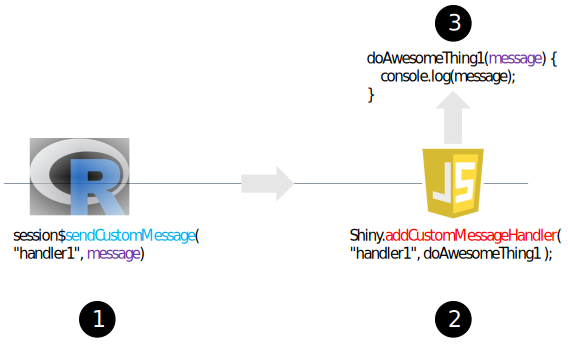
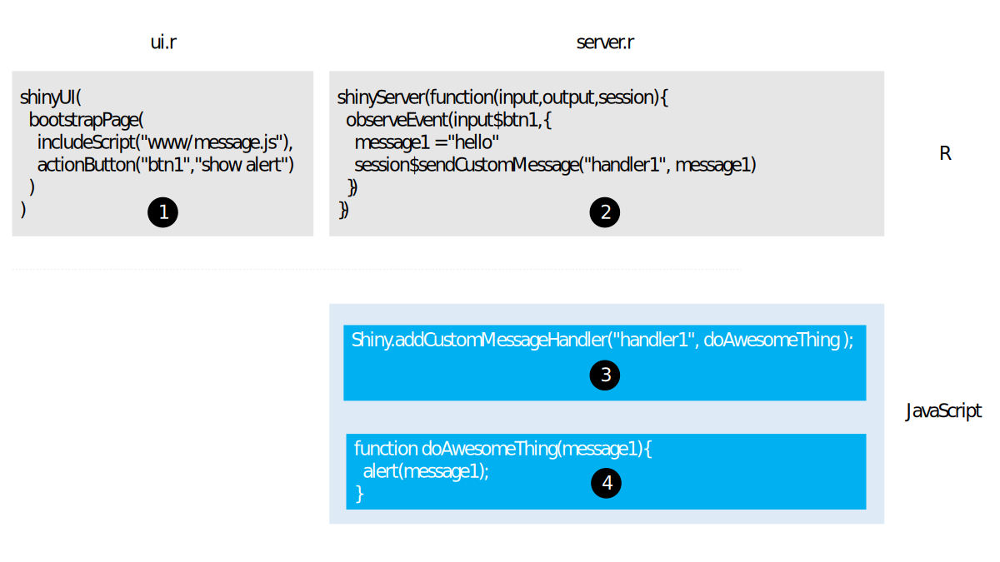
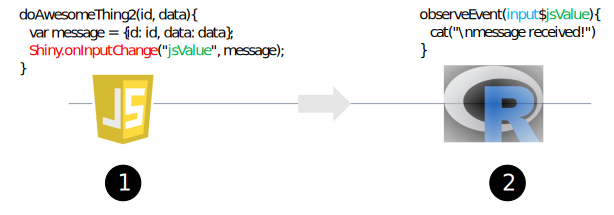
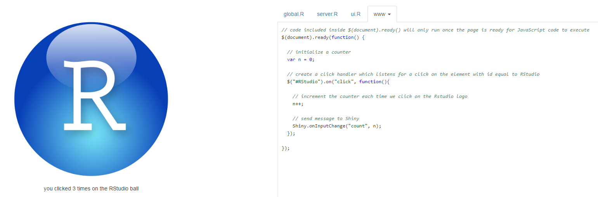
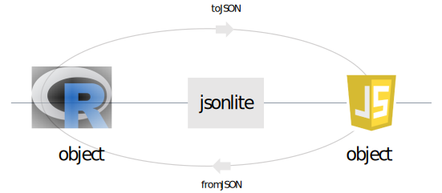
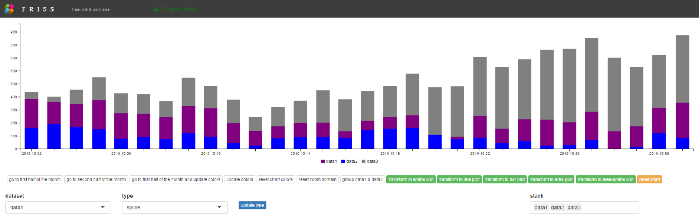

## Introduction

In the previous tutorial we learned how to create C3 based widgets for 

* a pie chart
* a combined line + bar chart, and 
* a stacked area chart. 

We mainly focused on constructing these charts from R and sending data in such a way that C3 could animate the transition between the old and new data. This tutorial is all about sending messages from R to JavaScript and back, including how to listen for events.

The ability to send and receive messages greatly improves the capabilities of our widgets, as C3 offers a powerful API with a vast set of options and methods that allow you to modify a chart after it is initialized. For instance, we can use messages to 

* update a legend
* add or remove data, or 
* focus the viewing area of a chart to a particular subset of its data. 

Importantly, we want to be able to do all of this from R. In addition, it want to be able to chain operations together via the pipe operator (%>%) in a way similar to ggplot2 (which uses the + operator).

### Messages, events and event listeners 

An advantage of JavaScript charts is that they lend themselves well to user interaction. For instance, you can have JavaScript highlight a specific segment of the chart when you hover over the [legend](http://c3js.org/samples/legend_custom.html). Or, you can have JavaScript remove a segment of the chart when you click on a legend element. [Tooltips](http://c3js.org/samples/tooltip_format.html) are another example of chart interaction, in which you can show additional information when hovering over particular elements in the chart. 

In JavaScript, things like clicking, hovering, brushing etc. are called [events](http://www.w3schools.com/js/js_events.asp). Often you want JavaScript to do something when an event occurs, i.e. you want to fire a specific function. An [event listener](http://www.w3schools.com/js/js_htmldom_eventlistener.asp), also called an *event handler*, is a special function that listens for particular events and that fires another function, called a *callback* function, if JavaScript detects the event. For instance, when you click a button, JavaScript can detect the click event via an event handler, which subsequently can fire another function.

JavaScript has many events that you can listen to, see [here](http://www.w3schools.com/js/js_events_examples.asp) for a more complete overview. Luckily, C3.js has an easy mechanism built in that allows you to call specific functions for click events, mouseover, mouseout and drag events. In this tutorial, you'll learn how to use these.  

## Sending and receiving messages from Shiny to JavaScript and back

So far we have discussed events that happen solely in JavaScript. Sometimes, however, you may want to: 

   1) activate JavaScript functions from R, e.g. to activate a chart method that modifies the chart, or 
   2) let Shiny listen to events that happen in the browser. 
   
Let's see how we can do that!

Shiny offers three pivotal functions for sending and receiving messages. These are:

  1) the R function `sendCustomMessage`
  2) the JavaScript function `Shiny.addCustomMessageHandler` 
  3) the JavaScript function `Shiny.onInputChange`.
  
In the last two items, `Shiny` refers to a JavaScript object that is provided by Shiny and is available in JavaScript during the lifetime of an app. This object has various methods e.g. `addCustomMessageHandler` and `onInputChange` that we can use. Before we use these methods in a C3 context, we first show two basic scenarios that use these functions. 

### Scenario 1: calling a JavaScript function from Shiny

Many modern R packages like [leaflet](http://rstudio.github.io/leaflet/), the [DT](http://rstudio.github.io/DT/) package, [visNetwork](http://dataknowledge.github.io/visNetwork) and [plotly](https://plot.ly/r/), use JavaScript functions behind the scenes to perform key functionality. However, as they are all R packages, they invoke such functions from R. How can we do the same? Consider the following figure: 





Suppose in JavaScript our main goal is to call the function `DoAwesomeThing1` (step 3), which has as an input object `message` and sends a simple text string to the browser [console](https://developers.google.com/web/tools/chrome-devtools/console/?hl=en).


If we want to call this function from R, we can create an event handler in JavaScript (step 2), that handles requests from R, which tells JavaScript to call the function and to pass it a message that it got from R. Suppose we call this handler `handler1`. In JavaScript, we can create a message handler like this:


``` javascript
Shiny.addCustomMessageHandler("handler1", doAwesomeThing1);
```

The first argument is the name of our handler, while the second argument is the callback function we want it to execute, i.e. `doAwesomeThing1`. Whenever this handler gets a message from Shiny, it will pass the message as a function argument and call our JavaScript function `doAwesomeThing1`. In the example, the function `doAwesomeThing1` displays the message via [console.log](http://www.w3schools.com/js/js_output.asp) to the browser console.

Finally, in R we can send a message to our handler (which lives in JavaScript) via: 


``` r
session$sendCustomMessage("handler1", message)
```

Here, `message` is a simple text string, e.g. `message <- "hello!"`. To make things more concrete, let's create an example.

### Example 1

Suppose we have a Shiny action button; and when we press it, we want R to send a message string, e.g. "hello!", to JavaScript. Subsequently, we want JavaScript to create an alert that shows the value JavaScript received from R. The following 4 step procedure shows how we can handle this scenario. The procedure contains an R part (steps 1 & 2, light gray) and a JavaScript part (steps 3 & 4, light blue). 


<a href = "https://js-tutorial.shinyapps.io/messageApp1/" target="_blank" >
  
</a>
<div style = "text-align: center; margin-bottom: 25px">Example calling a JavaScript function from R. Click on the image to see a shiny app implementing this example!</div>

At step 1, we define an action button in ui.R and we include a JavaScript file, i.e. message.js, which we store in the `www` folder of a Shiny app. The file message.js contains two pieces of JavaScript code, displayed in steps 3 and 4.  


In step 2, we create an `observeEvent` block, which is triggered via the action button. Inside it, we create a message and use `session$sendCustomMessage` with two arguments. The first argument is the name of the JavaScript message handler we want it to pass our message to. The second argument is the message itself. 

Next, on the JavaScript side (step 3) we add our custom message handler via `Shiny.addCustomMessageHandler`. We'll give the handler a name (or more formally, a type) equal to `handler1` and a callback function, i.e. `doAwesomeThing`. 

Finally, in step 4, we define the function `doAwesomeThing`, which has a single argument `message1`, which is subsequently used to raise an alert with the message. 


The complete code for this example app can be downloaded [here](https://github.com/FrissAnalytics/shinyJsTutorials/tree/master/tutorials/materials3/messageApp1).

### Scenario 2: sending a message from JavaScript to Shiny

Instead of sending a message from Shiny to JavaScript, we can also send messages from JavaScript to Shiny. These actions are often coupled to events, e.g. when we want R to do something when we click on an element. Such messages can be sent using the JavaScript method `Shiny.onInputChange`, which is made available by shiny. Consider the figure below:  





In this example, we have a JavaScript function `doAwesomeThing2`, which takes an id and some data object (this can be anything), who's task it is to send this information to Shiny. Within the function, here we first create an object with name message, and subsequently use it to send a message back to Shiny. Here, we tell it to make the message available in the R world under the name `jsValue`. That is, in R we can now listen for events via `input$jsValue`. So now if `doAwesomeThing2` is called, Shiny gets a message. Nice!


Caveat: Shiny only listens for *changes* in the value of a message. Hence, if you call `doAwesomeThing2` twice with the same arguments, the second call will not trigger the observeEvent block because the object you send is unchanged. This can be overcome by adding a random value to your object, which makes the object as a whole appear changed to Shiny. In R, you simply ignore that part of the object. Such a value is sometimes known as a *nonce*, see [here](https://github.com/rstudio/leaflet/search?utf8=%E2%9C%93&q=nonce). 


For instance in JavaScript via:

``` javascript
var message = {id: "id1", data = [1,2], nonce: Math.random()};
```

We can force reactivity in repeated calls to `doAwesomeThing2` even if the values of id and data don't change.

Let's see how we can incorporate these ideas into a small toy app!

### Example 2

Let's say that we have an image on a web page, e.g. the RStudio ball, and when we click on it, we want to send a message from JavaScript to R, indicating that we clicked on the image. To see a Shiny toy app implementing this example, click on the blue RSTUDIO ball below!


<p style = "margin:25px">
  <a href = "https://js-tutorial.shinyapps.io/messageApp2/" target = "_blank"></img></a>
  <div style = "text-align:center">example app showing how to use Shiny.onInputChange</div>  
</p>

If you run the app, the code can be seen next to the logo. Under the www tab you'll find the css file and the JavaScript file associated with this example. In the app, a counter below the logo shows how often you have clicked on the RStudio ball. 


The complete code for this example app can be downloaded [here](https://github.com/FrissAnalytics/shinyJsTutorials/tree/master/tutorials/materials3/messageApp2).


The example itself is slightly more complex then what we previously encountered and involves a number of techniques. However, a complete understanding will help you handle various things that can come up when you create more complex Shiny apps. Assuming you opened the app, here are a few things to notice:
 
 
  1) the ui.r file contains a link to a [css](http://www.w3schools.com/html/html_css.asp) file used to style the logo, to align the text under the image, and to change the mouse pointer on hover. 
  
  2) we included a JavaScript file `message.js` that initializes a counter `n` and sets up an event handler, in this case a [click handler](http://api.jquery.com/on/). The click handler increases the value of the counter each time we click the image and passes the value of `n` to Shiny via `Shiny.onInputChange` via a variable called `count`.
  
  3) the click handler is created via [jQuery](http://jquery.com/) (which comes standard with Shiny apps) and uses the $ sign (which is short for jQuery). jQuery is a JavaScript utility library packed with many useful functions. This library is known as the 'code less do more' library. If you're serious about Shiny, this library is well worth checking out! See [here](http://www.w3schools.com/jquery/) for an easy tutorial. Many jQuery functions work by using a [css selector](http://www.w3schools.com/cssref/css_selectors.asp) to create a selection and then to call a function on that selection. Of note, under the hood, jQuery plays an important role in many parts of the Shiny implementation by RSTUDIO. 
  
For C3, you don't have to create your own event listeners. However, it is very valuable if you understand how to create and use your own event listeners. 
  
  4) in server.r, we can capture the value sent by JavaScript via `input$count`. Note here we used [req](http://shiny.rstudio.com/reference/shiny/latest/req.html) to indicate that the value in `input$count` must be [truthy](http://shiny.rstudio.com/articles/req.html#truthy-and-falsy-values). 
  
  5) in message.js, we wrapped our code in [`$(document).ready(function() { ... }`](https://learn.jquery.com/using-jquery-core/document-ready/). This jQuery function will tell the browser to only run the code inside, once the page, i.e. the [Document Object Model](http://www.w3schools.com/js/js_htmldom.asp) (DOM), is ready for JavaScript code to execute. Note that when we activate this code too soon, i.e. before the image is loaded, we cannot yet attach an event handler to it. In other words, here we want to be sure that the image exists before attaching an event handler to it. 

### Data transformation from R to JavaScript and back

As noted in the [previous](http://shiny.rstudio.com/tutorial/js-lesson2/) tutorial, all objects that are sent from R to JavaScript, or from JavaScript to R, are tacitly passed and processed by Shiny via [jsonlite](https://cran.r-project.org/web/packages/jsonlite/vignettes/json-aaquickstart.html), using the functions `toJSON` and `fromJSON`. These functions transform R objects into JavaScript objects and vice versa. Especially in the beginning, this may lead to unexpected results, as the transformations are tacit and the returned objects may look different after processing then you might expect. With the hazard of sounding like a broken record: it's very well worth your time to investigate how objects are transformed!


<p style = "margin:25px">
  <a href = "https://cran.r-project.org/web/packages/jsonlite/vignettes/json-aaquickstart.html" target = "_blank"></img></a>
  <div style = "text-align:center">All objects that are send from R to JavaScript, or from JavaScript to R, are tacitly passed and processed by shiny via jsonlite.</div>  
</p>


## Sending messages from C3 to Shiny

In Example 2, we set up our own click handler using jQuery. If that was confusing, your worries are over! 

Luckily, C3 makes it very easy to bind functions to events without using jQuery. We can listen for:

  `onclick`, 
  `onmouseover`, 
  `onmouseout`,
  `ondragstart`, and 
  `ondragend` 
  
events, for instance. You can find more information on these events [here](http://c3js.org/reference.html#data-onclick). 


Consider the C3 pie in the following jsFiddle which contains data for series data1 and data2. Just click on a slice and see what happens! 


<iframe width='100%' height='425' src='https://jsfiddle.net/3u47j1n2/8/embedded/result,js,html' allowfullscreen='allowfullscreen' frameborder='0'></iframe>


Here we use C3 to pass some information on the slice we click on. Using the concepts from the sections above, we can send this information back to shiny as well.  


Consider the JavaScript panel of the fiddle above. Here we used the C3 `onclick` method to display some of C3's underlying data. Similar to [D3](https://d3js.org/), C3 stores this information in a variable called [d](https://d3js.org/#properties). For instance, we can extract the slice data name via `d.id`. In this fiddle, the bottom line shows the complete content stored in the `d` variable by C3. In order to display the content inside a div element, here we use jQuery's [html](http://api.jquery.com/html/) method, in concert with JavaScript's native [JSON.stringify](https://developer.mozilla.org/en/docs/Web/JavaScript/Reference/Global_Objects/JSON/stringify) method. The latter method allows you to convert a JavaScript object to JSON, which you then can print. 


Back to our example, relaying the information stored in `d.id` back to Shiny is quite easy with the help of our new found friend `Shiny.onInputChange`. In a Shiny context, the relevant code snippet to pass the information to Shiny would look something like this: 


```javascript
// c3 main method to construct a new chart
chart = c3.generate({
  bindto: el,
  data: {
  
    // insert toy data
    json : {"data1": 50,"data2": 120},
    
    type : 'pie',
    
    onclick: function(d, element) {
    
      // id of pie to shiny to input$chartId_click
      var inputId = el.id + "_click";
      
      // pie slice label
      var value = d.id;
      
      // send message to shiny
      Shiny.onInputChange(inputID,value);
    
    }
  }
});
```

Note that in this case, we are also interested in the id of the container element that holds the pie chart, which we can get via `el.id`. We are interested in this because we will want to know which specific pie we clicked on should we have multiple pie charts in the Shiny app. Here we use this id, combined with the string `_click` and use this *compound* id to send the value back to Shiny. 


Suppose the pie container has an id equal to `pie1`, then in a Shiny context, we can observe the underlying data of a pie slice click in R via `input$pie1_click`.

``` r
observeEvent(input$pie1_click,{
  cat("\nyou clicked on a pie with pie slice data:", input$pie1_click)
})
```

## Sending messages to an already existing chart

Sometimes we need to manipulate an already existing chart in order to control a specific aspect of that chart. Importantly, you would like to do that without redrawing the whole visualization from scratch. Fortunately, C3 provides a variety of [methods](http://c3js.org/reference.html#api-focus) to update a chart after it's rendered. 


To get an impression of what C3 can do, click the start button on the fiddle below and take a guided tour!


<iframe width='100%' height='400' src='https://jsfiddle.net/1so4zony/13/embedded/result,js,html' allowfullscreen='allowfullscreen' frameborder='0'></iframe>


As you can see, C3 can do quite a lot. Please take a look at the JavaScript panel of the fiddle above. In it, you'll encounter a `demos` array. This shows a lot of methods that allow you to update a chart. In the sections below, we'll see how we can use these methods from R.


## Creating chainable functions using the pipe operator

In the sections above, we learned how to send custom messages to JavaScript from R using `sendCustomMessage`. Even though it's great to have this ability, executing statements this way can become a bit cumbersome, especially if we want to send multiple messages. Wouldn't it be neat if we could chain statements like these? In particular, we would like to write code statements like:

```R
getChart('id') %>%  doAwesomeThing1() %>%  doAwesomeThing2() %>% doAwesomeThing3()
```

In the pseudo code above, we first get access to the chart object using an id and subsequently apply operation 1 on it. Then on the result of this we apply operation 2 and on the result of that we apply operation 3. The symbol %>% represents the **pipe** operator from the [magrittr](https://cran.r-project.org/web/packages/magrittr/index.html) package. 


The pipe operator is a [binary operator](https://en.wikipedia.org/wiki/Binary_operation) which places the argument on the left hand side as the first argument of the function on the right hand side, i.e. it turns an operation like `x %>% f(y)` into `f(x, y)`. How can we use this to create chainable statements? 

Actually, the trick is quite simple: 

> Always make sure that the return type of a chainable function is identical to its first argument. 

Note: here we're not really interested in the return type of each function, which is identical to something we have up front, i.e. its first argument, but in the side effects of each function, i.e. the messages they send via `sendCustomMessage`. Confused? Don't be, it will all be clear in a minute!    

### Creating a proxy object

In most practical cases, in order to send a custom message we need an `id`, so we can get to a specific chart instance, and a `session` object, which allows us to call the method `sendCustomMessage`. Here's a simple implementation:

```R
 c3ChartProxy <- function(id, session = shiny::getDefaultReactiveDomain()){

  proxy        <- list( id = shinyId, session = session )
  class(proxy) <- "c3ChartProxy"

  return(proxy)
}
```

Factually, all that this function does is to create a list that holds an id and a session object. For satefy, we also assign a class that can be used in other functions to check if we receive the object we expect. Here, we give it class `c3ChartProxy`, but this could be anything you like. 


In the code in the sections below, each chainable function receives this list as its first argument (via the pipe operator), but also uses this list as its return value. 


From the sections above we learned that we can call any JavaScript method an object has from R. So if we have access to the object, i.e. the chart, from R, we can send messages to JavaScript that update the chart, via the chart's own methods. This begs the question, if we have an id, how do we get access to a chart?

  
### Accessing a widget instance via an id

From the second tutorial, we know that in JavaScript we can define a widget via the function `HTMLWidgets.widget`, and that it has a factory method, which looks something like this:

``` javascript
HTMLWidgets.widget({

  name: ...,

  type: 'output',

  factory: function(el, width, height) {

    // create an empty chart
    var chart = null;

    return {

      renderValue: function(x) {

        // if the chart does not exist, create it via c3.generate
        if(chart === null){

             // create a C3 chart
             chart = c3.generate({
				     ...
            });
        }
		    ...
      }
  }
});
```

Here `chart` contains the actual C3 chart. If we have that, we can further manipulate the chart via any of C3's methods. Assuming we have access to our widget instance, how do we expose the chart that we create to the outside? Wait, mmm ... ah ha, we simply create a method just for it!

Luckily, this is extremely simple, i.e. we only need to add a function like this:


``` javascript
getChart: function(){
      return chart;
}
```

If we combine the previous two snippets we end up with:

``` javascript
HTMLWidgets.widget({

  name: ...,

  type: 'output',

  factory: function(el, width, height) {

    // create an empty chart
    var chart = null;

    return {

      renderValue: function(x) {

        // if the chart does not exist, create it via c3.generate
        if(chart === null){

             // create a C3 chart
             chart = c3.generate({
				      ...
            });
        }
		    ...
      },
    
      // a method to expose our chart to the outside
      getChart: function(){
        return chart;
      }
  }
});
```

Next, we create a little JavaScript helper function that given an HTMLWidgets instance, calls this method, i.e. `getChart`. Our helper function looks like this:

``` javascript
function getC3Chart(id){
  
  // Get the HTMLWidgets object
  var htmlWidgetsObj = HTMLWidgets.find("#" + id);
  
  // Use the getChart method we created to get the underlying C3 chart
  var c3Obj = htmlWidgetsObj.getChart();

  return(c3Obj);
}
```

Note here we use the `find()` method of our `HTMLWidgets` object, that allows us to find the widget instance that sits inside the element for a given css selector. As we can see, here we use the id to create a [css selector](schools.com/cssreF/sel_id.asp). 

Once we have the htmlWidgets instance, i.e. `htmlWidgetsObj `, we call our newly created `getChart()` method on it, which subsequently provides us access to our chart, i.e. `c3Obj`. Sweet! We can now use **any** valid method defined in the C3 API to manipulate our chart!

## Putting it all together

The sections above covered a lot of ground. Don't worry if this is a bit overwhelming. Here we present a toy Shiny app, that combines all the steps in the sections above, which lets you manipulate existing C3 charts in various ways. Just click on the image below to launch the app!

<br>
<a href = "https://js-tutorial.shinyapps.io/proxy_app/" target="_blank" >
  
</a>
<div style = "text-align: center; margin: 25px">Toy Shiny app demonstrating how we can manipulate a chart via a proxy object. Click on the image to see this app in action!</div>


Initially, the app shows a series of stacked bar charts, which displays three time series over a time period of 30 days, i.e. data1, data2 and data3. 

Using a set of action buttons, we can zoom to the first 15 days, the last 15 days, reset the zoom domain, or update and reset the bar colors. However, we can also transform the series into a set of line charts, area charts, or spline charts. We can also update the type of chart for each dataset independently, by using the bottom left controls and pressing the blue action button. Finally, we can use the bottom right selector to stack or unstack various series in the chart. 


#### About the app

The app implements various R and JavaScript functions that allow you to manipulate the chart. However, these are all based on the concept of using a proxy object, which is combined with an R function that sends a custom message to a JavaScript message handler, which then finds the chart object via our helper function `getC3Chart`, which subsequently  calls a C3 method on our chart. 


The demonstration app has 5 functions that allow you to modify an existing C3 chart, i.e. `zoomChart`, `setColors`, `setGroups`, `setTypes` and `transformTo`, which are accompanied by the JavaScript custom message handlers of the same name. It also uses an updated C3 package (from the previous tutorial), which in addition implements a slightly more robust version of `c3ChartProxy` and now also has a new `C3StackedChart` widget, with associated  `C3StackedChartOutput` (in ui.r)  and `renderC3StackedChart` (in server.R), Shiny helper functions.  


The complete code for this example app can be downloaded [here](https://github.com/FrissAnalytics/shinyJsTutorials/tree/master/tutorials/materials3/proxyApp). In addition,
you need to install an updated version of the C3 package, which you can download [here](https://github.com/FrissAnalytics/shinyJsTutorials/tree/master/tutorials/materials3/C3). Furthermore, this demo uses shinyBS, which you can download [here](https://ebailey78.github.io/shinyBS/install.html).


In the next section, we discuss the implementation of the `zoomChart` function, as used in the demo app. 


We leave it as an exercise to inspect the app source code to find out how the other functions are implemented. This process, however, is very similar to the steps described below. Furthermore, here we assume we already have an implementation that allows you to create and render a stacked chart widget. The code for this widget can be found [here](https://github.com/FrissAnalytics/shinyJsTutorials/tree/master/tutorials/materials3/C3/inst/htmlwidgets).


### Building a zoom function

Assumming we have a `C3StackedChart` widget function and a suitable render function `renderC3StackedAreaChart` (see [here](https://github.com/FrissAnalytics/shinyJsTutorials/tree/master/tutorials/materials3/C3/inst/htmlwidgets/C3StackedChart.js). In server.r, our code looks somewhat like this:

``` R
output$chart1 <- renderC3StackedAreaChart({
  
  C3StackedChart(dataset  = dataset,
                 types    = list(data1 = "bar", data2 = "bar", data3 = "bar"),
                 colors   = list(data1 = "purple", data2 = "blue", data3 = "gray"),
                 groups   = c("data1","data2","data3"))
})
```  
  
As we can see, our `C3StackedChart` takes four arguments. 

Here `dataset` is a dataframe (assumed created in an earlier step), with 30 rows (days) and 4 columns: one time column and one numeric column for each of the 3 series, in which each cell gives a total count per day for that series.

Next, `types` is a list that tells C3 to display each series as a set of bars; `colors` is a list that defines the color for each series, while `groups` tells C3 that we want to stack the data for series data1, data2 and data3 (instead of displaying each series next to each other). Note the id of the widget in this case is `chart1`.

Next, suppose we have an action button with id `update1` and when we press it, we want C3 to zoom our chart to a specific region. In server.r of our demonstration app, we have:

``` R
# update 1
observeEvent(input$update1, {
  c3ChartProxy("chart1") %>% zoomChart("2016-10-01", "2016-10-15")
})
```

This observe block uses our `c3ChartProxy` and calls `zoomChart`, which passes a start date and an end date for our zoom domain. 


In R, we defined `C3ChartZoom` as:


``` R
zoomChart <- function(chartProxy, minX, maxX){

  # prepair a message using the function arguments
  message <- list(id = chartProxy$id, minX = minX, maxX = maxX)

  # send a custom message to JavaScript
  chartProxy$session$sendCustomMessage("zoomChart", message)
  
  # return the proxy i.e. the list that holds the chart id and session object
  # so we can plug it into the next function (if any), via the pipe operator
  return(chartProxy)
}
```

Note that `chartProxy` provides access to both the `session` object (which we can send via custom messages), as well as the widget id, which allows us to get to the correct chart.  


Next, in JavaScript we create a custom message handler, that given an id, gets the correct chart and subsequently calls a C3 method on that chart, passing any required data it got from R. 

Here's what our ZoomC3Chart custom message handler looks like:

``` javascript
Shiny.addCustomMessageHandler('zoomChart', function(message){
    
    // get the correct HTMLWidget instance
    var chart = getC3Chart(message.id);

    // parse the dates received from R to the correct format, using a tiny bit of JavaScript
    var minDate = Date.parse(message.minX);
    var maxDate = Date.parse(message.maxX);

    // call the C3 zoom method, which according to the C3 reference needs an array 
    chart.zoom([minDate,maxDate]);
});
``` 

Note that here, via message, we get the widgets id. We can get our actual chart object back via our helper function `getC3Chart`. When we have this, we simply call a built in C3 method, here [zoom](http://c3js.org/reference.html#api-zoom), and provide it with the data it needs, i.e. two JavaScript data objects. 


## Closing remarks

Congrats! You made it to the end! This tutorial, by far, is the most technical tutorial of all the Shiny JavaScript tutorials in this series. Don't worry if you didn't get everything the first time, experimenting with R and JavaScript takes a bit of time.


Luckily, on CRAN and GITHUB there are many HTMLWidgets available. By looking at the source code of other widget implementers, you can learn a lot about how things work! For those who want to use JavaScript to extend shiny, we suggest you also look into [shinyJS](https://github.com/daattali/shinyjs), which offers a lot of handy JavaScript routines out of the box. To pay attribution, many of the concepts on sending custom messages were inspired by [this](https://ryouready.wordpress.com/2013/11/20/sending-data-from-client-to-server-and-back-using-shiny/) excellent blog post and by looking into the source code of both RSTUDIO's [leaflet](https://github.com/rstudio/leaflet) and the awesome [visNetwork](https://github.com/datastorm-open/visNetwork) package.      


## Next tutorial

In the next tutorial, we will look into an entirely different aspect of Shiny apps: how to create a dynamic interactive help system! In that tutorial, we will show you how you can create a step-by-step guide for a website via [intro.js](http://introjs.com/), which allows you to draw cool HTML based boxes around elements of your choice, combined with an annotation layer and a navigation system. Each aspect is explained in depth in a step by step manner. As a bonus, we present a completely tricked out shiny example app, that allows you to use intro.js to switch tab panels in a multi page shiny app, use voice recognition to activate and control intro.js and that uses voice synthesis to speak out the text inside each box, all from within a Shiny app! Sweet!
