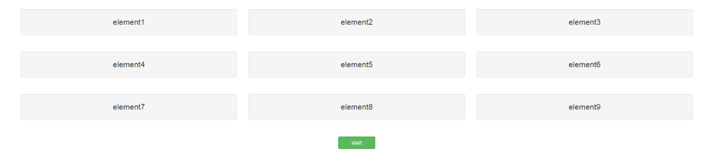
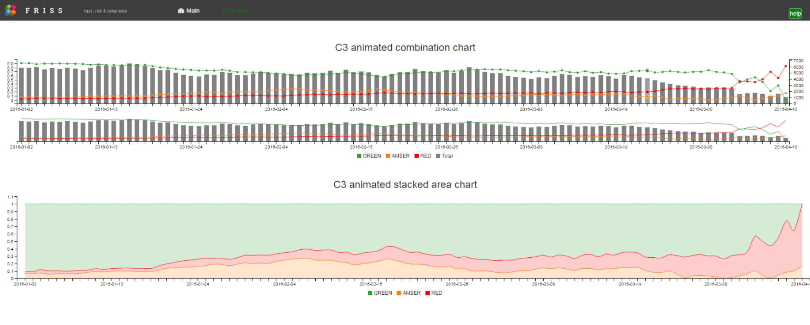

## Introduction

In the previous tutorials, we focused on using JavaScript to create htmlwidgets based on [C3](http://c3js.org/). To do this, we used three pivotal functions:

1. the R function `sendCustomMessage`, which you can call via the session object, i.e `session$sendCustomMessage` 
2. the JavaScript function `Shiny.onInputChange` 
3. the JavaScript function `Shiny.addCustomMessageHandler`. 


In this tutorial, we will show you how to use the same functions to create a dynamic interactive help system for Shiny apps, based on the JavaScript library [introJS](http://introjs.com/).


IntroJS lets you create a step-by-step guide for a website. It will draw a nice box around elements of your choice, combined with an annotation layer and a navigation system. Click the green button in the example below to see an introJS 'hello-world' example in action. 

<iframe src = "http://introjs.com/example/hello-world/index.html" width = "100%" height = "600px" frameborder="0" scrolling ="no"></iframe>
  

## Intro.js basics and jsFiddle

Using introJS in a piece of HTML code is very simple. Let's first set up a jsFiddle example that uses a [bootstrap](http://getbootstrap.com/) grid of 3 rows, with 3 columns each. In addition, let's add a button that you can click to activate introJS. 


<iframe width='100%' height='500px' src='https://jsfiddle.net/ok1vzopq/6/embedded/result,html,js,css' allowfullscreen='allowfullscreen' frameborder='0'></iframe>
<div style = "text-align:center">press the green start button to activate introJS</div>

<br><br>
We can add introJS to the app in three steps, described in detail [here](https://github.com/usablica/intro.js/):

  1) Include [introjs.css](https://raw.githubusercontent.com/usablica/intro.js/master/introjs.css) and [intro.js](https://raw.githubusercontent.com/usablica/intro.js/master/intro.js) with your page. 
  
  
  2) For each element in the tour, add a `data-intro`, a `data-position`, and an optional `data-step` attribute.
  <br><br> 
  These respectively specify the display text, the position of the box displayed by introJS, and the step number of 
  the tour.   
  
  3) In order to start the tour, in JavaScript, call `introJs().start();`.
  

In the HTML tab of our fiddle, we see that the first row is created via:

```html
<div class="row">
  <div class="col-sm-4 well" data-step="1" data-intro="text step 1" data-position='bottom'>element 1</div>
  <div class="col-sm-4 well" data-step="2" data-intro="text step 2" data-position='bottom'>element 2</div>
  <div class="col-sm-4 well" data-step="3" data-intro="text step 3" data-position='bottom'>element 3</div>
</div>

```
  
The classes `row`, `col-sm-4`, and `well` are all bootstrap classes, which define the grid layout. [Bootstrap](http://getbootstrap.com/) is the most popular HTML, CSS, and JavaScript framework for developing responsive, mobile first projects on the web. For some inspiration, see [these](http://www.w3schools.com/bootstrap/bootstrap_grid_examples.asp) examples. For more complete use cases, see [these](http://getbootstrap.com/getting-started/#examples) templates. 

Of note, many layout functions in Shiny are directly based on bootstrap. For instance, in a Shiny context the R code snippet:

```
fluidRow(
  column(4,"element 1")
)
``` 

produces an output that resembles row 1 in our example (but without the introJS attributes and well classes).

Coming back to introJS, from the HTML code in the example above we see that it is quite easy to add the `data-step`, `data-intro` and `data-position` attributes. 

Next, in the JavaScript tab of our fiddle, we've attached an event handler to our button using [jQuery](https://jquery.com/) (see also [tutorial 3](http://shiny.rstudio.com/tutorial/js-lesson3/)). Here we use the event handler to start introJS on a button click, i.e. via the JavaScript code:

```javascript
$("button").on("click", function(){
	introJs().start(); 
})
```

In the CSS tab of our jsFiddle, we've set some styling options to center the button and the text in the example. In the CSS definitions we use [flexbox](https://developer.mozilla.org/en-US/docs/Web/CSS/CSS_Flexible_Box_Layout/Using_CSS_flexible_boxes) to center the button. Even though flexbox is by no means a focus point of this tutorial and is 
 a relative new addition to the CSS language, it greatly enhances your abilities to create page layouts via CSS. For a complete guide to flexbox, see [this](https://css-tricks.com/snippets/css/a-guide-to-flexbox/) article by CSS-tricks!

Finally, you may wonder, where did we included the JavaScript and CSS file from step 1? You can find the links when pressing the  button, located at the top right in our example fiddle. This opens up a new display with a panel on the left hand side that contains an External Resources tab, which includes all the external dependencies for our jsFiddle, i.e. the introjs CSS and JavaScript files, Bootstrap and jQuery. 

Of note, in a standard Shiny app you don't need to explicitly load either Bootstrap or jQuery as they are included automatically by Shiny. However, if you base your app on [HTML Templates](http://shiny.rstudio.com/articles/templates.html), then be careful you don't mistakenly include multiple jQuery or Bootstrap instances. In case you need to, you can also suppress specific web dependencies via [suppressDependencies](http://shiny.rstudio.com/reference/shiny/latest/suppressDependencies.html). This function can be helpful if distinct widgets include different versions of the same library e.g. different versions of d3.js.


### Using JSON to setup introJS

Even though the previous example creates a tour, it's not very convenient to manually set all the attributes for each element. Luckily, introJS allows you to use a [JSON array](http://www.w3schools.com/json/json_syntax.asp) to specify all relevant options, in which each step can use a CSS selector to indicate where we want to draw a box, what should be in it and where the box should be displayed relative to the selected element, among other things. The fiddle below shows an implementation using this concept. 


<iframe width='100%' height='500px' src='https://jsfiddle.net/czumyL8j/2/embedded/result,html,js,css' allowfullscreen='allowfullscreen' frameborder='0'></iframe>
<div style = "text-align:center">press the green start button to activate introJS</div>

<br><br>

The output is identical to the fiddle in the previous section. However, you can see in the HTML tab that we greatly simplified the HTML markup and now only need an id field. Furthermore, in the JavaScript tab you can see that we specified an array that contains objects that describe the individual steps in the tour. The array for the first two steps looks like this:

``` javascript
var Steps = [
    {
      element: '#step1',
      intro: "text step 1",
      position: 'bottom'
    },
    {
      element: '#step2',
      intro: "text step 2",
      position: 'bottom'
    }
];
```

Finally, we created an instance of introJS, loaded the data via the `setOptions` method and subsequently started the tour. The relevant code looks like this:

``` javascript
// initialize an introjs instance          
var intro = introJs();

// pass in the Steps array created earlier
intro.setOptions({steps: Steps });

// start intro.js
intro.start();
```


Note that all of this code is located inside the callback function for our button click event handler. Hence, this code will only fire after we press the button! 

### Customization and additional methods

IntroJS is a versatile library, which offers many additional functions and options next to those discussed here. For a more comprehensive overview of additional attributes that allow customization, see [here](https://github.com/usablica/intro.js/wiki/Documentation#attributes). 


In addition, introJS offers a rich set of methods such as: `introJs.nextStep()`, `introJs.previousStep()` and `introJs.exit()`.
  
These methods allow you to control the direction of the guided tour. For many of these methods, introJS let's you call a JavaScript function, before, during or after completion, e.g. via: `introJs.onchange`, `introJs.oncomplete`  and `introJs.onexit`. 
  

A complete list of methods is provided [here](https://github.com/usablica/intro.js/wiki/Documentation). 


Caveat: for some functionality in more recent versions of introJS ($\geq$ 2), an inexpensive licence is required for commercial applications. All functionality in this tutorial work with earlier versions though.


## Using introJS in a Shiny app

Now that we have a better grasp on what introJS offers, let's see how we can use introJS in a Shiny context. The idea is quite simple.


From the previous tutorial, we know that we can call any JavaScript function from R by using `session$sendCustomMessage`, which sends a message to an event handler, which we can create via `Shiny.addCustomMessageHandler`. Furthermore, we can use `Shiny.onInputChange` inside a JavaScript function to send a message back to the Shiny `input` object, e.g. when we click on a box. 


Now that we know which JavaScript functions to call and what our data should look like, we can setup Shiny to make these calls.


For our first Shiny based introJS app, we are not going to put the code in an R package. This makes the steps easier to follow. It also makes it easier for you to experiment with the code. For readers who just want to use introJS in a Shiny app, without knowing all the details, we made an R package that you can download and use. We explain how to use this package in the next section.

A live version of the end result of a first basic Shiny implementation can be found [here](https://js-tutorial.shinyapps.io/BasicDemoIntroJS/) and the source code can be found [here](https://github.com/FrissAnalytics/shinyJsTutorials/tree/master/tutorials/materials4/BasicDemoIntroJS).


<a href = "https://js-tutorial.shinyapps.io/BasicDemoIntroJS/" target="_blank" >
  
</a>
<div style = "text-align: center; margin-bottom: 25px">Click the image to see a live shiny app!</div>


We proceed by discussing the various steps needed to make the above demo app work and how you can start making your own JavaScript powered apps.

### Create small toy examples first

When you're building new Shiny functionality, it is often useful to first build a small prototype in HTML and JavaScript (without Shiny). This let's you focus on:

* which CSS and JavaScript files to include
* how to structure your data 
* how to call specific library functions 

Essentially, this is the role that our jsFiddle examples fill in our tutorials. After you're comfortable that your mini application works the way you want, the sole trick is to let Shiny include the files you need, and to use Shiny to build the HTML elements you need. After that, just let Shiny call whatever JavaScript function(s) you need to call and pass any data via jsonlite (Shiny will implicitly do this for you, see [here](http://shiny.rstudio.com/tutorial/js-lesson3/#data-transformation-from-r-to-javascript-and-back)).


In the case at hand, to go from the fiddle shown above, to a Shiny app, we have to implement the following steps:
  
  1) Make Shiny include the correct CSS and JavaScript files
  2) Let Shiny spit out the HTML you need
  3) In R, send a custom message to the client i.e. JavaScript, with the data we need introJS to have
  4) In JavaScript, setup a custom message handler that can call introJS and pass it the data it needs 

### Creating the UI code

Coming back to our jsFiddle, note that many layout functions rely on bootstrap classes. In fact, in Shiny, the `fluidRow` and `column` functions create divs with a `row` and `col-sm-x` class, respectively. Hence, these functions almost provide the HTML output of our first introJS fiddle example. We only need to add an extra div to each column to make it right.

First, we start by copying the CSS we defined in the fiddle into a separate file, i.e. `app.css`, such that we can use the custom `well` and `flexcontainer` classes.

The ui.R code snippet below shows how to get the first row of elements, including the start button, as well as how to load all of the dependencies that we need. We also include a file called `app.js`, which contains all of the client side code that we need to update the help contents and start the help (see below).

```R
# Include IntroJS styling
includeCSS("introjs.min.css"),

# Include styling for the app
includeCSS("app.css"),

# Include IntroJS library
includeScript("intro.min.js"),

# Include JavaScript code to make shiny communicate with introJS
includeScript("app.js")

# setup grid
# row 1
fluidRow(
  column(4, div(id="step1", class="well", "element1")),
  column(4, div(id="step2", class="well", "element2")),
  column(4, div(id="step3", class="well", "element3"))
),
...

# centered button
div(class="flexcontainer", 
    
    # action button
    actionButton(inputId="startHelp", label="start", class="btn-success")
)
```

### Send help contents from the server to the client

Next, let's see what we should put in `app.js`. 


The first thing we need to do is to initiate introJS. We can do this exactly like in our fiddle i.e. via `var intro = introJs();`. Next, instead of setting the help contents in JavaScript, we want to be able to set the help contents dynamically from Shiny. 


As mentioned above, we can use the JavaScript method `Shiny.addCustomMessageHandler` to create a custom message handler that we can invoke from R. In our case, the handler must be able to receive tour data in the same format as described in the fiddle above and to pass this data to the introJS object `intro`. 

Putting these steps together results in the following JavaScript code:
```javascript
// initialize an introjs instance          
var intro = introJs();

// handler 1
Shiny.addCustomMessageHandler("setHelpContent",
  
  // callback function. 
  // note: data is passed by shiny and contains the tour data
  function(data){

    // load data 
    intro.setOptions({steps: data});
  }
);
```

Our handler is called `setHelpContent`, which is the name we'll use when sending information from R via `session$sendCustomMessage` (see below).

To conveniently configure our help system, we can put the help contents into a comma separated configuration file, e.g.`help.csv`. 


In our case, `help.csv` looks like this: 

``` {r echo=FALSE}
helpData <- read.csv("help.csv")
library(DT)

DT::datatable(helpData,rownames = FALSE, options = list(dom = 't'))
```

<br><br>
From left to right, the columns respectively indicate: the step number, the display text for that step, the CSS selector and the position in which we want the text box to appear. The value for the latter option can be either `top`, `left`, `right`, `bottom`, `bottom-left-aligned`, `bottom-middle-aligned`, `bottom-right-aligned` or `auto`. If left empty, the default option equals `bottom`. 

Once we have our dataframe ready to go (here called `steps`), we can send it to introJS via: 

```R
# set help content
session$sendCustomMessage(type = 'setHelpContent', message = list(steps = toJSON(steps) ))
```

Essentially, you can use one of three basic strategies to send information that introJS needs from R to JavaScript:

1. Send the information from R in a convenient R structure. Then further modify the object in JavaScript to create the object JavaScript needs. 
2. Reshape the information in R so that when Shiny passes it as jsonlite (see tutorial 2 & 3), it ends up as the precise object that JavaScript needs. 
3. A combination of strategies 2 and 3. 


Note that we didn't send `steps` from R directly. Instead, we sent `toJSON(steps)`, which means we went with strategy 2. This is only to ensure that JavaScript gets the object it needs. In practice, this step often needs some experimentation to see how you can best send an object from R to JavaScript. Similar logic holds for sending objects from JavaScript to R. 


### Start the help from the server

All that remains is to create a mechanism to start the help from the server. As you might have guessed, this mechanism is again constructed via a custom message handler, in which we invoke `introJS.start()`:

``` javascript
// handler 2
Shiny.addCustomMessageHandler("startHelp", function(message) {

    // start intro.js
    // note: we don't need information from shiny, just start introJS
    intro.start();
  }
);
```

Note that we could also directly add an [onClick](http://www.w3schools.com/jsref/event_onclick.asp) attribute to our button like we did in the examples above. An advantage of the approach taken here is that we have more control over our help because we can now invoke it from the server i.e. Shiny.

To invoke the help from the server, we add an `observeEvent` block in R. This block listens to our button and calls `sendCustomMessage` to invoke our `startHelp` handler as defined above: 

```R
# listen to the action button
observeEvent(input$startHelp,{
  
  # on click, send custom message to start help
  session$sendCustomMessage(type = 'startHelp', message = list(""))
})
```

### introJS demo package

Below we present a Shiny demo app that contains a compete implementation of the various aspects discussed above. For convenience, we made the code available as an R package.


We won't cover the complete code base in detail as this involves various aspects related to package building e.g. using [addResourcePath](http://shiny.rstudio.com/reference/shiny/latest/addResourcePath.html) to include dependencies, which is outside the scope of this tutorial. The complete code for this example app can be downloaded [here](https://github.com/FrissAnalytics/shinyJsTutorials/tree/master/tutorials/materials4/C3_demo_IntroJS), while the accompanying R package can be downloaded [here](https://github.com/FrissAnalytics/shinyJsTutorials/tree/master/tutorials/materials4/FrissIntroJSBasic). 

In short, the R library lets you:

  1) Load a definition of the help content via a dataframe, which is subsequently transformed into a JSON array (like in the jsFiddle above)
  2) Automatically add a help button to the page to activate introJS
  3) Automatically add all introJS related JavaScript and CSS dependencies to the app 
  4) Automatically create an introJS instance
  5) Automatically pass the help settings from step 1 to the introJS instance

To see the package in action, press the screenshot below!

<p style = "margin:25px">
  <a href = "https://js-tutorial.shinyapps.io/C3_demo_IntroJSBasic/" target = "_blank"></img></a>
  <div style = "text-align:center">Shiny C3 dashboard app with basic help system using the R introJS package</div>  
</p>


In the remainder of this tutorial, we describe how you can use our introJS R package in a real Shiny app. This is illustrated in an extended version of the dashboard app that we showed in the previous tutorials. 

### Using the introJS package in a Shiny app


With the help of our [introJS package](https://github.com/FrissAnalytics/shinyJsTutorials/tree/master/tutorials/materials4/FrissIntroJSBasic), using introJS in a Shiny application is a breeze! Only the following 3 simple steps are needed:

  1) in global.R, create a dataframe, e.g. called `helpData`, in which each row specifies:
    <br><br>
    i) the step number, 
    ii) the display text for that step
    iii) the [CSS selector](http://www.w3schools.com/cssref/css_selectors.asp) to select the correct element
    iv) the position we want the text box to appear in
    <br><br>
  
  2) in ui.R, call `addIntroJS()`
  
  3) in server.R, call `initIntroJS` and pass in `session` and `helpData`
  
That's it! The package will handle:

* creating of the JSON object
* setting up the message handlers
* inserting the associate introJS, CSS, and JavaScript files 
* creating of the button
* setting up the click handler
* passing the data to introJS, and 
* activating introJS.  
  
In the example app, we created a dataframe similar to the one discussed above by reading in a predefined CVS file whose contents look like this: 

``` {r echo=FALSE}
library(DT)

helpData <- read.csv("help.csv")

DT::datatable(helpData,rownames = FALSE, options = list(dom = 't'))
```


#### Implemenation details

Briefly, the package implementation contains an R file, called `FRISSIntroJS.R`, which contains the `addIntroJS` and `initIntroJS` functions, as well as a JavaScript file, called `IntroJSBinding.js`, which is located in the package `www` folder. The latter file contains the JavaScript logic for the introJS component. Please feel free to inspect the annotated source code to familiarize yourself with the various aspects of package building. 

Obviously, many different implementations of introJS are possible, so don't be too worried if you don't understand all of the aspects of this code base or feel another way of implementing some features is more appropriate. Furthermore, our package is by no means a full fledged implementation and only serves to illustrate alternative uses of the key JavaScript functions discussed above.


## Advanced example

As a bonus, we present a completely tricked out toy example app, that allows you to use introJS, switch tab panels in a Shiny app via introJS, use voice recognition to activate introJS, and dynamically update the content inside an introJS message box. The app even uses voice synthesis to speak out the text inside each box! A full discussion of this code base is well beyond the scope of this tutorial. However, it serves as a nice illustration to see what's possible when combining JavaScript with Shiny code! Here speech recognition is based on [annyang](https://www.talater.com/annyang/).


Caveat 1: most parts of this code only work in recent versions of the [Chrome](https://www.google.com/chrome/browser/desktop/) browser. 


Caveat 2: the current voice recognition capabilities of Chrome are rather limited and often buggy, which likely leave production applications out of scope based on our approach. 


To see this demo in action, navigate a recent version of the Chrome browser to [this](https://js-tutorial.shinyapps.io/C3_demo_IntroJSAdvanced/) link. You can download the complete code base [here](https://github.com/FrissAnalytics/shinyJsTutorials/tree/master/tutorials/materials4/C3_demo_IntroJSAdvanced).


<p style = "margin:25px">
  <a href = "https://js-tutorial.shinyapps.io/C3_demo_IntroJSBasic/" target = "_blank"></img></a>
  <div style = "text-align:center">Shiny C3 dashboard app advanced example, with tab switching via introJS, using voice recognition and voice synthesis.</div>  
</p>

<br>
