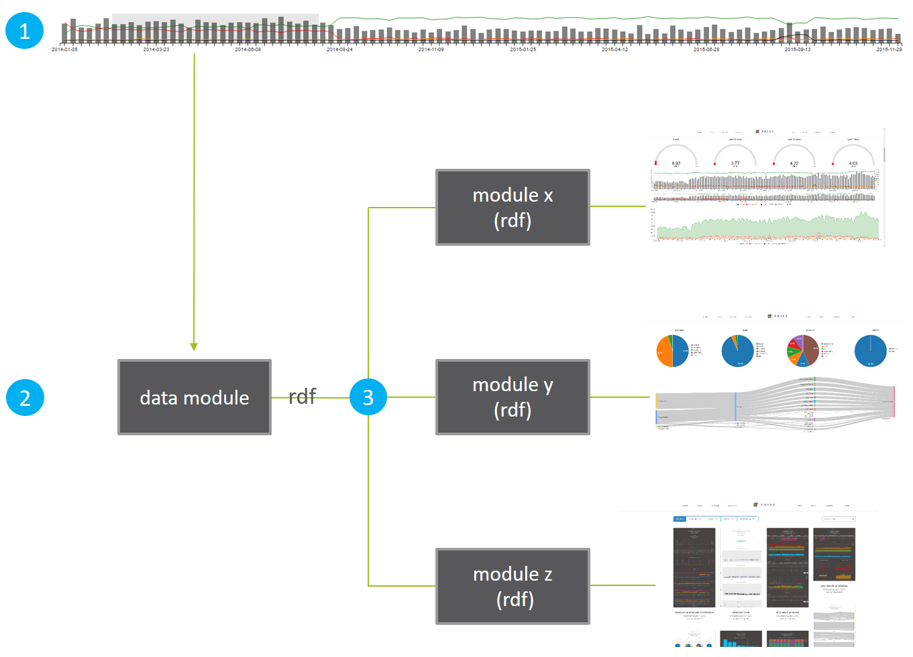
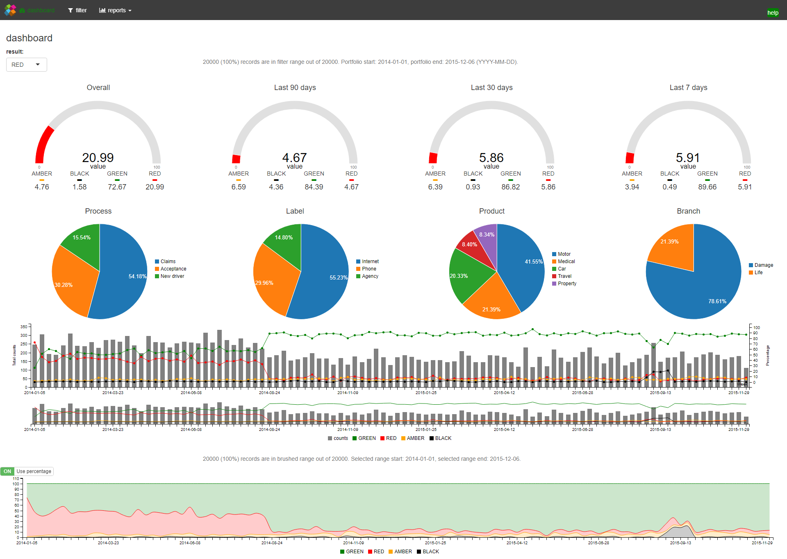
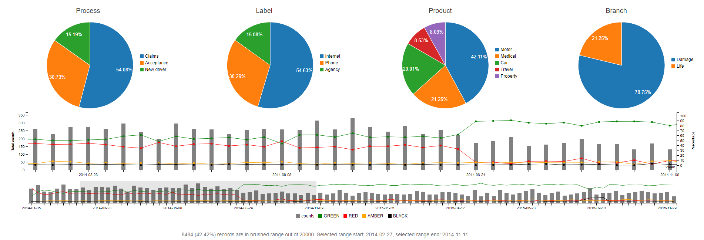
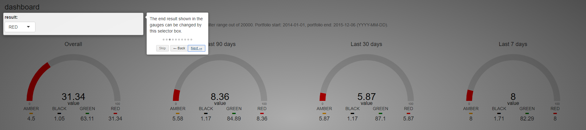
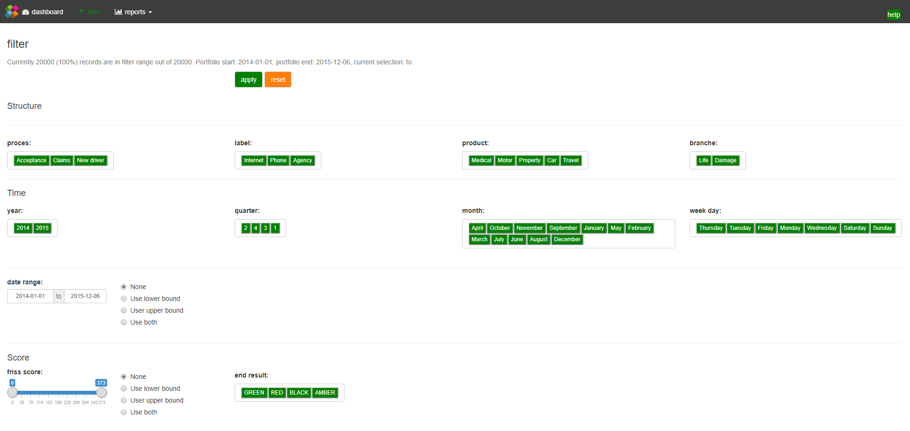
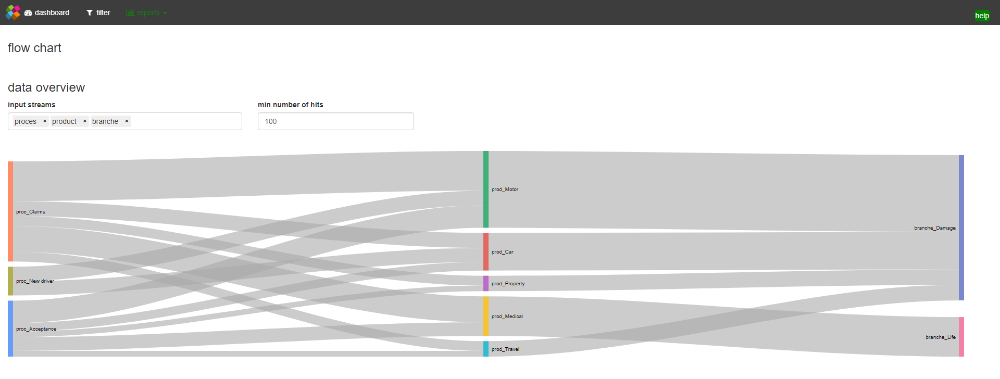
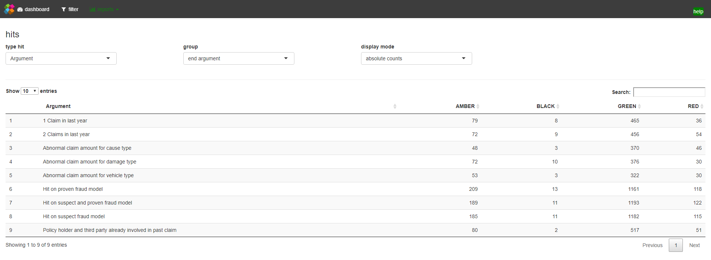

## Introduction

In this tutorial we'll put everything together we've learned in the previous five tutorials to create an interactive dashboard. We learn how we can set up an interactive filter system that uses a brushable timeline component and the button groups developed in the previous tutorial. In addition, we learn how to send events from JavaScript to R at different rates such that we don't overflow R with computations when we slide our brush over the timeline. Finally, in order to control the complexity of our app, we'll use Shiny modules to create a modular code base for our dashboard. 

## Module setup

The dashboard layout is based on the [navbarPage](https://shiny.rstudio.com/reference/shiny/latest/navbarPage.html) layout. This layout creates a page with a top level navigation bar and has several [tabPanels](https://shiny.rstudio.com/reference/shiny/latest/tabPanel.html). In addition, it contains a button on the right hand side to launch the interactive help system developed in tutorial 4.

<p style = "margin:25px">
  </img>
  <div style = "text-align:center">navbar layout</div>  
</p>


Each tabpanel, however, only holds a single Shiny [module](https://shiny.rstudio.com/articles/modules.html) (see below). You can think of a module as a piece of a Shiny app. Furthermore, a module usually has reactive inputs and outputs. More in depth discussions on Shiny modules are available [here](http://shiny.rstudio.com/articles/modules.html) and [here](https://www.rstudio.com/resources/webinars/understanding-shiny-modules/). 
From a module perspective, our dashboard essentially has three main pillars: 

1. A front panel module with a brushable timeline to filter the data on the front panel, combined with a filter module with a set of buttongroups (not shown) to filter the data of the whole app.
2. A filter processing reactive that depends on the filter module that outputs a reactive data frame (rdf).
3. A set of other modules that take the reactive data as their input.

The figure below provides a graphical overview of this setup:

<p style = "margin:25px">
  </img>
  <div style = "text-align:center">Passing a reactive into a module</div>  
</p>

For the sake of this tutorial it doesn't really matter what the modules x, y, and z do in step 3. It only matters that they all take the same reactive dataset as their input and that the data module reacts to the filter module, which in turn depends on the brush events in the timeline and the button group filter controls. 


## Capturing timeline brush events 

In [tutorial 3](https://shiny.rstudio.com/tutorial/js-lesson3/)) we've created a `C3LineBarChart`, that has a brushable timeline, based on C3 [subchart](http://c3js.org/reference.html#subchart-onbrush) method. 

Here's what the timeline part of our C3LineBarChart looks like:

<p style = "margin:25px">
  </img>
  <div style = "text-align:center">timeline with a brush</div>  
</p>

To add a brushable subchart in C3 we simply call the `subchart` method inside `c3.generate`:

```javascript
c3.generate({
  ...
  subchart: {
    show: true,
    onbrush: function (domain) { ... }
  }
})
```

This code snippet tells C3 we want to add a subchart and call a function when an `onbrush` event occurs.

In our case, `domain` refers to the timeline domain of our chart i.e. the brush start and end dates. Inside the onbrush callback i.e. `function (domain) { ... }`, we can easily tell JavaScript to send the domain information to Shiny, using the `Shiny.onInputChange` method (see [tutorial 3](https://shiny.rstudio.com/tutorial/js-lesson3/)). 

However, this may trigger a large number of events when we slide the brush around. Therefore, we introduce a `rate policy`, to limit the number of events. 

### Controling the number of events

Event listeners such as a brush may fire many events. If these events are coupled with expensive computations, e.g. filtering a big data set, this can result in a poor user experience. Therefore, we sometimes might want to limit the number of events that get sent. Two popular ways of controlling the number of events are *throttling* and *debouncing*. 

*Throttling* means no more than one event will be sent per x milliseconds, while *debouncing* means all of the events will be ignored until no events have been received for x milliseconds, at which time the most recent event will be sent. Luckily, using [underscore.js](http://underscorejs.org/#throttle_), applying throttling or debouncing is quite straightforward.

Suppose we want to debounce events using a 250 millisecond interval and then send the `domain` info to Shiny. Using underscore and `Shiny.onInputChange` the relevant code snippet becomes:

```javascript
subchart: {
  show: true,
  onbrush: _.debounce( function (domain) {Shiny.onInputChange(el.id + "-domain", domain)} , 250)
}
```

Note that we wrapped the anonymous function `function (domain) {Shiny.onInputChange(el.id + "-domain", domain)}` inside a call to `_.debounce( ... , 250)` and that is it. In the code above, `el.id` is simply the id of our chart. For example, say the id equals `id1`, then in R we can capture the start and end times in a vector via `input$"id1-domain"`. Now we can rest assured that when we move the brush we don't flood Shiny with events since only after we've stopped moving the brush for at least 250 milliseconds an event gets sent!

## Putting it all together: a complete example

A complete example application involving all aspects from the previous tutorials can be found can be downloaded [here](https://github.com/FrissAnalytics/dashboard_showcase). 

This repo contains the complete code base for a small dashboard application, that has a front page module using a number of C3 based HTMLWidgets, a brushable timeline component, our custom input binding switch component, as well as the intro.js based help system developed in tutorial 4. 

The example app also involves a small filter module using the custom input binding button groups. Finally, the example contains two simple modules that consume the filtered data by visualizing a subset of the data via a Sankey chart from the [googleVis](https://cran.r-project.org/web/packages/googleVis/vignettes/googleVis_examples.html) package and a datatable from the [DT](https://rstudio.github.io/DT/) package.

The screenshots below give an impression of the various parts of the dashboard demo app:

### Dashboard front page

<p style = "margin:25px">
  </img>
  <div style = "text-align:center">dashboard front page with C3.js HTMLWidgets and a custom input binding switch</div>  
</p>

### Dashboard brushable timeline

<p style = "margin:25px">
  </img>
  <div style = "text-align:center">Dashboard brushable timeline filter</div>  
</p>

### Dashboard intro.js based help system

<p style = "margin:25px">
  </img>
  <div style = "text-align:center">Dashboard intro.js based help system</div>  
</p>

### Dashboard filter module with custom input binding button groups

<p style = "margin:25px">
  </img>
  <div style = "text-align:center">Simple filter module with custom input binding button groups</div>  
</p>

### Complementary module 1 consuming the filtered data (sankey)

<p style = "margin:25px">
  </img>
  <div style = "text-align:center">Complementary module consuming the filtered data, using a Sankey chart</div>  
</p>

### Complementary module 2 consuming the filtered data (datatable)
<p style = "margin:25px">
  </img>
  <div style = "text-align:center">Complementary module consuming the filtered data, using a datatable</div>  
</p>

To run this example you must first run the `install.R` script inside the [packages](https://github.com/FrissAnalytics/dashboard_showcase/tree/master/packages) folder of the [repo](https://github.com/FrissAnalytics/dashboard_showcase). This script makes sure all dependencies are installed.


## Outlook

In this series we have described the process of extending the capabilities of Shiny apps with JavaScript. In the first 3 tutorials we mostly focused our attention on creating [HTMLWidgets](http://www.htmlwidgets.org/), based on [C3.js](http://c3js.org/), which in turn is based on [d3.js](https://d3js.org/). In tutorial 4 we've shown how you can use other JavaScript libraries such as [intro.js](http://introjs.com/) to make a step-by-step guide for your Shiny apps, while in tutorial 5 we learned how to create your own [custom input bindings](https://shiny.rstudio.com/articles/building-inputs.html). Finally, in this tutorial we've combined all the previous techniques into a complete dashboard app and learned how to control the number of events so Shiny isn't flooded with computations. So where to go from here?

Fortunately, there are tons of other JavaScript libraries that can be useful to tie into the Shiny ecosystem. For some excellent work on combining JavaScript and Shiny, please check out the work of Kent Russell i.e. [timeportfolio](https://twitter.com/timelyportfolio?ref_src=twsrc%5Egoogle%7Ctwcamp%5Eserp%7Ctwgr%5Eauthor) or [buildingwidgets](http://www.buildingwidgets.com/blog), or the work on [shinyjs](https://github.com/daattali/shinyjs) by Dean Attali. Both served as an inspiration for the work in this tutorial series.  

The most flexible JavaScript visualization framework that Shiny can benefit from is likely d3.js. Unfortunately, d3.js has a quite steep learning curve. A good resource for getting started with d3.js is [Interactive Data Visualization for the Web](http://alignedleft.com/work/d3-book) by Scott Murray, while a more in depth treatment is provided in [D3.js in Action](https://www.manning.com/books/d3js-in-action-second-edition) by Elijah Meeks. Of note, d3.js itself is actively developed, which often means more work for widget builders. 

For instance, at the time of writing d3.js has moved to version 4.x, which is a major departure from the 3.x version. This creates challenges for widget builders as older code is likely to break. Unfortunately, this is also the case for the current version of C3.js, which depends on d3.js version 3.5.0. A fork of C3.js, called [billboard.js](https://naver.github.io/billboard.js/) has recently been released. Billboard.js has feature parity with C3.js, however, it uses d3.js version 4+ under the hood! 

A very useful feature of Shiny is that you can always extend it by using raw HTML, CSS, and JavaScript. Hence, investing in these techniques is always sensible as they are what the web is about! If you're just starting out, one of the best and most accessible books on these techniques are the books by Duckett i.e. [HTML & CSS](http://www.htmlandcssbook.com/) and [JavaScript & jQuery](http://javascriptbook.com/). The knowledge in these books are excellent starting points to dive deeper into more complex Shiny features such as [HTMLTemplates](https://shiny.rstudio.com/articles/templates.html) and [Crosstalk](https://github.com/rstudio/crosstalk), which can bring your Shiny apps and widgets to an even higher level!


